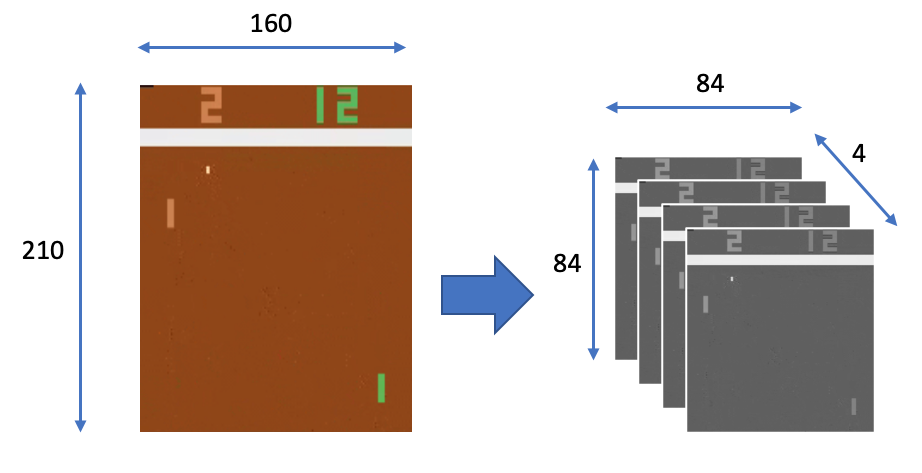

{
 "metadata": {
  "language_info": {
   "codemirror_mode": {
    "name": "ipython",
    "version": 3
   },
   "file_extension": ".py",
   "mimetype": "text/x-python",
   "name": "python",
   "nbconvert_exporter": "python",
   "pygments_lexer": "ipython3",
   "version": "3.6.10-final"
  },
  "orig_nbformat": 2,
  "kernelspec": {
   "name": "python3610jvsc74a57bd05fb7ba6b29a291de1e2db4e1fd4b7e6e9b78e63b92ad1e6cf7a4db351a48cfb2",
   "display_name": "Python 3.6.10 64-bit ('generative': conda)"
  }
 },
 "nbformat": 4,
 "nbformat_minor": 2,
 "cells": [
  {
   "cell_type": "code",
   "execution_count": 26,
   "metadata": {},
   "outputs": [],
   "source": [
    "# For Environment\n",
    "import gym\n",
    "\n",
    "# For Environment Warppers\n",
    "from openai_wrappers.atari_wrappers import make_atari,wrap_deepmind, wrap_pytorch, MaxAndSkipEnv, FireResetEnv\n",
    "\n",
    "# For Network\n",
    "import torch\n",
    "import torch.nn as nn\n",
    "import torch.optim as optim\n",
    "import torch.autograd as autograd\n",
    "import torch.functional as F\n",
    "\n",
    "# For replay buffer\n",
    "from collections import deque\n",
    "import random\n",
    "\n",
    "# For common use\n",
    "import copy\n",
    "import numpy as np\n",
    "import matplotlib.pyplot as plt\n",
    "%matplotlib inline"
   ]
  },
  {
   "source": [
    "## Environment 'Atari'"
   ],
   "cell_type": "markdown",
   "metadata": {}
  },
  {
   "cell_type": "code",
   "execution_count": 27,
   "metadata": {},
   "outputs": [],
   "source": [
    "env_name = 'BreakoutNoFrameskip-v4'\n",
    "env = gym.make(env_name)\n",
    "state = env.reset()\n",
    "next_state, reward, done, _ = env.step(action = 0)"
   ]
  },
  {
   "cell_type": "code",
   "execution_count": 28,
   "metadata": {},
   "outputs": [
    {
     "output_type": "stream",
     "name": "stdout",
     "text": [
      "Num of Actions :  4\nAction meaning :  ['NOOP', 'FIRE', 'RIGHT', 'LEFT']\nState Size :  (210, 160, 3)\nState Example\n"
     ]
    },
    {
     "output_type": "execute_result",
     "data": {
      "text/plain": [
       "<matplotlib.image.AxesImage at 0x25522aa8438>"
      ]
     },
     "metadata": {},
     "execution_count": 28
    },
    {
     "output_type": "display_data",
     "data": {
      "text/plain": "<Figure size 432x288 with 1 Axes>",
      "image/svg+xml": "<?xml version=\"1.0\" encoding=\"utf-8\" standalone=\"no\"?>\r\n<!DOCTYPE svg PUBLIC \"-//W3C//DTD SVG 1.1//EN\"\r\n  \"http://www.w3.org/Graphics/SVG/1.1/DTD/svg11.dtd\">\r\n<!-- Created with matplotlib (https://matplotlib.org/) -->\r\n<svg height=\"251.799629pt\" version=\"1.1\" viewBox=\"0 0 206.156071 251.799629\" width=\"206.156071pt\" xmlns=\"http://www.w3.org/2000/svg\" xmlns:xlink=\"http://www.w3.org/1999/xlink\">\r\n <metadata>\r\n  <rdf:RDF xmlns:cc=\"http://creativecommons.org/ns#\" xmlns:dc=\"http://purl.org/dc/elements/1.1/\" xmlns:rdf=\"http://www.w3.org/1999/02/22-rdf-syntax-ns#\">\r\n   <cc:Work>\r\n    <dc:type rdf:resource=\"http://purl.org/dc/dcmitype/StillImage\"/>\r\n    <dc:date>2021-04-09T20:05:54.181255</dc:date>\r\n    <dc:format>image/svg+xml</dc:format>\r\n    <dc:creator>\r\n     <cc:Agent>\r\n      <dc:title>Matplotlib v3.3.3, https://matplotlib.org/</dc:title>\r\n     </cc:Agent>\r\n    </dc:creator>\r\n   </cc:Work>\r\n  </rdf:RDF>\r\n </metadata>\r\n <defs>\r\n  \r\n </defs>\r\n <g id=\"figure_1\">\r\n  <g id=\"patch_1\">\r\n   <path d=\"M 0 251.799629 \r\nL 206.156071 251.799629 \r\nL 206.156071 0 \r\nL 0 0 \r\nz\r\n\" style=\"fill:none;\"/>\r\n  </g>\r\n  <g id=\"axes_1\">\r\n   <g id=\"patch_2\">\r\n    <path d=\"M 33.2875 227.921504 \r\nL 198.956071 227.921504 \r\nL 198.956071 10.481504 \r\nL 33.2875 10.481504 \r\nz\r\n\" style=\"fill:#ffffff;\"/>\r\n   </g>\r\n   <g clip-path=\"url(#p1f3522f06e)\">\r\n    <image height=\"218\" id=\"imaged54673c604\" transform=\"scale(1 -1)translate(0 -218)\" width=\"166\" x=\"33.2875\" xlink:href=\"data:image/png;base64,\r\niVBORw0KGgoAAAANSUhEUgAAAKYAAADaCAYAAAAsaDnNAAAGNklEQVR4nO3dQWsTeRjH8WfiTNImJragG5ciPRUiWCgiXUqLItjFPexJD+JV9uzBg5c9+BL26HvwpoJaPPRYxJu7pwYP7UnKsjGJmxiTyR6EbFNk/pnNdPLL9vsBDwNPJ0/tl04nbVPPzPoGiMlMegHgWwgTkggTkggTkggTkggTkggTkggTkggTkggTkggTkggTkggTkvwLP65FDnzYeWedejOldYCv/KU7P0UO1Hb3CBOJms9mbf3cucgZP6VdgIGFfN5+XV6OnCFMUQXft+W5ubHO8XutZs1uN5mFUkaYoi7k8/bblStjneOXnR17V6sls1DKuCuHJMKEJD8XepEDlDsZ3X7fDtrtsc7xJQwT2iZZfc+zTi4XOeNv1guRA3/0TtnHJLfCSKqNhv28vT3pNY5Fs1Syt9euRc7wCRGSCBOSCBOSCBOSCBOSCBOSCBOSCBOSCBOSCBOSCBOSCBOSCBOSCBOSCBOSCBOSCBOSCBOSCBOSCBOSCBOSCBOSCBOSCBOSCBOSCBOSCBOSCBOSCBOSCBOSCBOSCBOSCBOSCBOSCBOSCBOSCBOSCBOSCBOSCBOSCBOSCBOSCBOSCBOSCBOSCBOSCBOSCBOSCBOSCBOSCBOSCBOSCBOSCBOSCBOSCBOSCBOSCBOSCBOSCBOSCBOSCBOSCBOSCBOSCBOSCBOSCBOSCBOSCBOSCBOSCBOSCBOSCBOSCBOSCBOSCBOSCBOSCBOSCBOSCBOSCBOSCBOSCBOSCBOSCBOSCBOSCBOSCBOSCBOSCBOSCBOSCBOSCBOSCBOSCBOSCBOSCBOSCBOSfNfAhcU7lst30tgFJ0T5u6xzxhlm+ftNyxWKiSwEmJnNnWmY2bvIGS7lkESYkESYkESYkOS8+fHmPpiX/SuNXXBCeAX3szzOME+tPrXAryeyEGBm5n85Y9b4IXKGSzkkESYkESYkESYkOW9+MmaWsX4Kq+CkyHjuGWeYm94HCzIHSewDmJnZF++zfXTMcCmHJMKEJMKEJMKEJMKEJOddeWnft1w3SGMXnBBt37ePpegZZ5gWmmXCEZ54Akbkhe4ZLuWQRJiQRJiQRJiQ5Lz5ybezVui4f0EdGJWXTeAFD4JexrJd9807MKrPp9wXai7lkESYkESYkESYkOS+q/nb//oPSIjXc/fkfiWOP3OWqecTWQgwM/PO5JwzXMohiTAhiTAhiTAhyXnz0+x2rdfhjwMgOa1u1znjDPP+27e2t7eXyEKAmdni4qLdX1+PnOFSDkmECUmECUmECUmECUmECUmECUmECUmECUmECUmECUmECUmECUmECUmECUmECUmECUmECUmECUmECUmECUmECUmECUmECUnOFzwoFos2Pz+fxi44IYrFonPGGea9e/cSWQaIg0s5JBEmJBEmJBEmJBEmJBEmJBEmJBEmJBEmJBEmJBEmJBEmJBEmJBEmJHkXL17sT3oJ4CjPzAgTcpw/KDwJV69etXK5PPJ8q9Wy58+fD449z7Pbt2/HesydnR3b398fHC8tLdnKykqsczx58iTWvEuxWLSbN2/Geptnz55Zu91OdI+jbt26ZZnMv18FvnjxwprNZqKPIRlmpVKxSqUy8nytVhsK08xsbW0t1mPu7u4OhXn+/PlY5+j3+4mHOTs7G/v9ePXq1bGHubq6akEQDI63t7dPRphHVatVe//+/eD47Nmzdvny5VjneP36tYVhODheX1+3QqEw8tvXajV78+bN4DgIArt+/XqsHeL69OmTbW1tRc5sbm6a53nHusckTE2Yhz9AlUoldphbW1vWPfTniFdWVmKH+fLly8Hx7OxsKmEefsxvuXHjBmEiXTMzM3bp0qXImf9jlGaEKa1UKtndu3cnvcZEEOYUCcPQqtVq5MzhL1emGWFOkV6vZ48fP570GqmYijBPnz499Lzmf3llkHK5PPTZxPfjvetBEAztMDMzE3uHcXme53x+9+DgYOjZh2k1FWFubGzYxsbGWOd48ODBWG+/sLBgDx8+HOsc4/J937nDo0ePrF6vp7TR8ZEMs9VqxfrP/daTu3E/OEe/Nut0OhP/AIdhGHuHfv/4v8PcaDSGrjjH8Rma75VDEj/2BkmECUmECUmECUn/AJJpF+TqsFmXAAAAAElFTkSuQmCC\" y=\"-9.921504\"/>\r\n   </g>\r\n   <g id=\"matplotlib.axis_1\">\r\n    <g id=\"xtick_1\">\r\n     <g id=\"line2d_1\">\r\n      <defs>\r\n       <path d=\"M 0 0 \r\nL 0 3.5 \r\n\" id=\"m449e1d3cb9\" style=\"stroke:#000000;stroke-width:0.8;\"/>\r\n      </defs>\r\n      <g>\r\n       <use style=\"stroke:#000000;stroke-width:0.8;\" x=\"33.805214\" xlink:href=\"#m449e1d3cb9\" y=\"227.921504\"/>\r\n      </g>\r\n     </g>\r\n     <g id=\"text_1\">\r\n      <!-- 0 -->\r\n      <g transform=\"translate(30.623964 242.519942)scale(0.1 -0.1)\">\r\n       <defs>\r\n        <path d=\"M 31.78125 66.40625 \r\nQ 24.171875 66.40625 20.328125 58.90625 \r\nQ 16.5 51.421875 16.5 36.375 \r\nQ 16.5 21.390625 20.328125 13.890625 \r\nQ 24.171875 6.390625 31.78125 6.390625 \r\nQ 39.453125 6.390625 43.28125 13.890625 \r\nQ 47.125 21.390625 47.125 36.375 \r\nQ 47.125 51.421875 43.28125 58.90625 \r\nQ 39.453125 66.40625 31.78125 66.40625 \r\nz\r\nM 31.78125 74.21875 \r\nQ 44.046875 74.21875 50.515625 64.515625 \r\nQ 56.984375 54.828125 56.984375 36.375 \r\nQ 56.984375 17.96875 50.515625 8.265625 \r\nQ 44.046875 -1.421875 31.78125 -1.421875 \r\nQ 19.53125 -1.421875 13.0625 8.265625 \r\nQ 6.59375 17.96875 6.59375 36.375 \r\nQ 6.59375 54.828125 13.0625 64.515625 \r\nQ 19.53125 74.21875 31.78125 74.21875 \r\nz\r\n\" id=\"DejaVuSans-48\"/>\r\n       </defs>\r\n       <use xlink:href=\"#DejaVuSans-48\"/>\r\n      </g>\r\n     </g>\r\n    </g>\r\n    <g id=\"xtick_2\">\r\n     <g id=\"line2d_2\">\r\n      <g>\r\n       <use style=\"stroke:#000000;stroke-width:0.8;\" x=\"85.576643\" xlink:href=\"#m449e1d3cb9\" y=\"227.921504\"/>\r\n      </g>\r\n     </g>\r\n     <g id=\"text_2\">\r\n      <!-- 50 -->\r\n      <g transform=\"translate(79.214143 242.519942)scale(0.1 -0.1)\">\r\n       <defs>\r\n        <path d=\"M 10.796875 72.90625 \r\nL 49.515625 72.90625 \r\nL 49.515625 64.59375 \r\nL 19.828125 64.59375 \r\nL 19.828125 46.734375 \r\nQ 21.96875 47.46875 24.109375 47.828125 \r\nQ 26.265625 48.1875 28.421875 48.1875 \r\nQ 40.625 48.1875 47.75 41.5 \r\nQ 54.890625 34.8125 54.890625 23.390625 \r\nQ 54.890625 11.625 47.5625 5.09375 \r\nQ 40.234375 -1.421875 26.90625 -1.421875 \r\nQ 22.3125 -1.421875 17.546875 -0.640625 \r\nQ 12.796875 0.140625 7.71875 1.703125 \r\nL 7.71875 11.625 \r\nQ 12.109375 9.234375 16.796875 8.0625 \r\nQ 21.484375 6.890625 26.703125 6.890625 \r\nQ 35.15625 6.890625 40.078125 11.328125 \r\nQ 45.015625 15.765625 45.015625 23.390625 \r\nQ 45.015625 31 40.078125 35.4375 \r\nQ 35.15625 39.890625 26.703125 39.890625 \r\nQ 22.75 39.890625 18.8125 39.015625 \r\nQ 14.890625 38.140625 10.796875 36.28125 \r\nz\r\n\" id=\"DejaVuSans-53\"/>\r\n       </defs>\r\n       <use xlink:href=\"#DejaVuSans-53\"/>\r\n       <use x=\"63.623047\" xlink:href=\"#DejaVuSans-48\"/>\r\n      </g>\r\n     </g>\r\n    </g>\r\n    <g id=\"xtick_3\">\r\n     <g id=\"line2d_3\">\r\n      <g>\r\n       <use style=\"stroke:#000000;stroke-width:0.8;\" x=\"137.348071\" xlink:href=\"#m449e1d3cb9\" y=\"227.921504\"/>\r\n      </g>\r\n     </g>\r\n     <g id=\"text_3\">\r\n      <!-- 100 -->\r\n      <g transform=\"translate(127.804321 242.519942)scale(0.1 -0.1)\">\r\n       <defs>\r\n        <path d=\"M 12.40625 8.296875 \r\nL 28.515625 8.296875 \r\nL 28.515625 63.921875 \r\nL 10.984375 60.40625 \r\nL 10.984375 69.390625 \r\nL 28.421875 72.90625 \r\nL 38.28125 72.90625 \r\nL 38.28125 8.296875 \r\nL 54.390625 8.296875 \r\nL 54.390625 0 \r\nL 12.40625 0 \r\nz\r\n\" id=\"DejaVuSans-49\"/>\r\n       </defs>\r\n       <use xlink:href=\"#DejaVuSans-49\"/>\r\n       <use x=\"63.623047\" xlink:href=\"#DejaVuSans-48\"/>\r\n       <use x=\"127.246094\" xlink:href=\"#DejaVuSans-48\"/>\r\n      </g>\r\n     </g>\r\n    </g>\r\n    <g id=\"xtick_4\">\r\n     <g id=\"line2d_4\">\r\n      <g>\r\n       <use style=\"stroke:#000000;stroke-width:0.8;\" x=\"189.1195\" xlink:href=\"#m449e1d3cb9\" y=\"227.921504\"/>\r\n      </g>\r\n     </g>\r\n     <g id=\"text_4\">\r\n      <!-- 150 -->\r\n      <g transform=\"translate(179.57575 242.519942)scale(0.1 -0.1)\">\r\n       <use xlink:href=\"#DejaVuSans-49\"/>\r\n       <use x=\"63.623047\" xlink:href=\"#DejaVuSans-53\"/>\r\n       <use x=\"127.246094\" xlink:href=\"#DejaVuSans-48\"/>\r\n      </g>\r\n     </g>\r\n    </g>\r\n   </g>\r\n   <g id=\"matplotlib.axis_2\">\r\n    <g id=\"ytick_1\">\r\n     <g id=\"line2d_5\">\r\n      <defs>\r\n       <path d=\"M 0 0 \r\nL -3.5 0 \r\n\" id=\"m08eaba4fbd\" style=\"stroke:#000000;stroke-width:0.8;\"/>\r\n      </defs>\r\n      <g>\r\n       <use style=\"stroke:#000000;stroke-width:0.8;\" x=\"33.2875\" xlink:href=\"#m08eaba4fbd\" y=\"10.999219\"/>\r\n      </g>\r\n     </g>\r\n     <g id=\"text_5\">\r\n      <!-- 0 -->\r\n      <g transform=\"translate(19.925 14.798438)scale(0.1 -0.1)\">\r\n       <use xlink:href=\"#DejaVuSans-48\"/>\r\n      </g>\r\n     </g>\r\n    </g>\r\n    <g id=\"ytick_2\">\r\n     <g id=\"line2d_6\">\r\n      <g>\r\n       <use style=\"stroke:#000000;stroke-width:0.8;\" x=\"33.2875\" xlink:href=\"#m08eaba4fbd\" y=\"36.884933\"/>\r\n      </g>\r\n     </g>\r\n     <g id=\"text_6\">\r\n      <!-- 25 -->\r\n      <g transform=\"translate(13.5625 40.684152)scale(0.1 -0.1)\">\r\n       <defs>\r\n        <path d=\"M 19.1875 8.296875 \r\nL 53.609375 8.296875 \r\nL 53.609375 0 \r\nL 7.328125 0 \r\nL 7.328125 8.296875 \r\nQ 12.9375 14.109375 22.625 23.890625 \r\nQ 32.328125 33.6875 34.8125 36.53125 \r\nQ 39.546875 41.84375 41.421875 45.53125 \r\nQ 43.3125 49.21875 43.3125 52.78125 \r\nQ 43.3125 58.59375 39.234375 62.25 \r\nQ 35.15625 65.921875 28.609375 65.921875 \r\nQ 23.96875 65.921875 18.8125 64.3125 \r\nQ 13.671875 62.703125 7.8125 59.421875 \r\nL 7.8125 69.390625 \r\nQ 13.765625 71.78125 18.9375 73 \r\nQ 24.125 74.21875 28.421875 74.21875 \r\nQ 39.75 74.21875 46.484375 68.546875 \r\nQ 53.21875 62.890625 53.21875 53.421875 \r\nQ 53.21875 48.921875 51.53125 44.890625 \r\nQ 49.859375 40.875 45.40625 35.40625 \r\nQ 44.1875 33.984375 37.640625 27.21875 \r\nQ 31.109375 20.453125 19.1875 8.296875 \r\nz\r\n\" id=\"DejaVuSans-50\"/>\r\n       </defs>\r\n       <use xlink:href=\"#DejaVuSans-50\"/>\r\n       <use x=\"63.623047\" xlink:href=\"#DejaVuSans-53\"/>\r\n      </g>\r\n     </g>\r\n    </g>\r\n    <g id=\"ytick_3\">\r\n     <g id=\"line2d_7\">\r\n      <g>\r\n       <use style=\"stroke:#000000;stroke-width:0.8;\" x=\"33.2875\" xlink:href=\"#m08eaba4fbd\" y=\"62.770647\"/>\r\n      </g>\r\n     </g>\r\n     <g id=\"text_7\">\r\n      <!-- 50 -->\r\n      <g transform=\"translate(13.5625 66.569866)scale(0.1 -0.1)\">\r\n       <use xlink:href=\"#DejaVuSans-53\"/>\r\n       <use x=\"63.623047\" xlink:href=\"#DejaVuSans-48\"/>\r\n      </g>\r\n     </g>\r\n    </g>\r\n    <g id=\"ytick_4\">\r\n     <g id=\"line2d_8\">\r\n      <g>\r\n       <use style=\"stroke:#000000;stroke-width:0.8;\" x=\"33.2875\" xlink:href=\"#m08eaba4fbd\" y=\"88.656362\"/>\r\n      </g>\r\n     </g>\r\n     <g id=\"text_8\">\r\n      <!-- 75 -->\r\n      <g transform=\"translate(13.5625 92.45558)scale(0.1 -0.1)\">\r\n       <defs>\r\n        <path d=\"M 8.203125 72.90625 \r\nL 55.078125 72.90625 \r\nL 55.078125 68.703125 \r\nL 28.609375 0 \r\nL 18.3125 0 \r\nL 43.21875 64.59375 \r\nL 8.203125 64.59375 \r\nz\r\n\" id=\"DejaVuSans-55\"/>\r\n       </defs>\r\n       <use xlink:href=\"#DejaVuSans-55\"/>\r\n       <use x=\"63.623047\" xlink:href=\"#DejaVuSans-53\"/>\r\n      </g>\r\n     </g>\r\n    </g>\r\n    <g id=\"ytick_5\">\r\n     <g id=\"line2d_9\">\r\n      <g>\r\n       <use style=\"stroke:#000000;stroke-width:0.8;\" x=\"33.2875\" xlink:href=\"#m08eaba4fbd\" y=\"114.542076\"/>\r\n      </g>\r\n     </g>\r\n     <g id=\"text_9\">\r\n      <!-- 100 -->\r\n      <g transform=\"translate(7.2 118.341295)scale(0.1 -0.1)\">\r\n       <use xlink:href=\"#DejaVuSans-49\"/>\r\n       <use x=\"63.623047\" xlink:href=\"#DejaVuSans-48\"/>\r\n       <use x=\"127.246094\" xlink:href=\"#DejaVuSans-48\"/>\r\n      </g>\r\n     </g>\r\n    </g>\r\n    <g id=\"ytick_6\">\r\n     <g id=\"line2d_10\">\r\n      <g>\r\n       <use style=\"stroke:#000000;stroke-width:0.8;\" x=\"33.2875\" xlink:href=\"#m08eaba4fbd\" y=\"140.42779\"/>\r\n      </g>\r\n     </g>\r\n     <g id=\"text_10\">\r\n      <!-- 125 -->\r\n      <g transform=\"translate(7.2 144.227009)scale(0.1 -0.1)\">\r\n       <use xlink:href=\"#DejaVuSans-49\"/>\r\n       <use x=\"63.623047\" xlink:href=\"#DejaVuSans-50\"/>\r\n       <use x=\"127.246094\" xlink:href=\"#DejaVuSans-53\"/>\r\n      </g>\r\n     </g>\r\n    </g>\r\n    <g id=\"ytick_7\">\r\n     <g id=\"line2d_11\">\r\n      <g>\r\n       <use style=\"stroke:#000000;stroke-width:0.8;\" x=\"33.2875\" xlink:href=\"#m08eaba4fbd\" y=\"166.313504\"/>\r\n      </g>\r\n     </g>\r\n     <g id=\"text_11\">\r\n      <!-- 150 -->\r\n      <g transform=\"translate(7.2 170.112723)scale(0.1 -0.1)\">\r\n       <use xlink:href=\"#DejaVuSans-49\"/>\r\n       <use x=\"63.623047\" xlink:href=\"#DejaVuSans-53\"/>\r\n       <use x=\"127.246094\" xlink:href=\"#DejaVuSans-48\"/>\r\n      </g>\r\n     </g>\r\n    </g>\r\n    <g id=\"ytick_8\">\r\n     <g id=\"line2d_12\">\r\n      <g>\r\n       <use style=\"stroke:#000000;stroke-width:0.8;\" x=\"33.2875\" xlink:href=\"#m08eaba4fbd\" y=\"192.199219\"/>\r\n      </g>\r\n     </g>\r\n     <g id=\"text_12\">\r\n      <!-- 175 -->\r\n      <g transform=\"translate(7.2 195.998438)scale(0.1 -0.1)\">\r\n       <use xlink:href=\"#DejaVuSans-49\"/>\r\n       <use x=\"63.623047\" xlink:href=\"#DejaVuSans-55\"/>\r\n       <use x=\"127.246094\" xlink:href=\"#DejaVuSans-53\"/>\r\n      </g>\r\n     </g>\r\n    </g>\r\n    <g id=\"ytick_9\">\r\n     <g id=\"line2d_13\">\r\n      <g>\r\n       <use style=\"stroke:#000000;stroke-width:0.8;\" x=\"33.2875\" xlink:href=\"#m08eaba4fbd\" y=\"218.084933\"/>\r\n      </g>\r\n     </g>\r\n     <g id=\"text_13\">\r\n      <!-- 200 -->\r\n      <g transform=\"translate(7.2 221.884152)scale(0.1 -0.1)\">\r\n       <use xlink:href=\"#DejaVuSans-50\"/>\r\n       <use x=\"63.623047\" xlink:href=\"#DejaVuSans-48\"/>\r\n       <use x=\"127.246094\" xlink:href=\"#DejaVuSans-48\"/>\r\n      </g>\r\n     </g>\r\n    </g>\r\n   </g>\r\n   <g id=\"patch_3\">\r\n    <path d=\"M 33.2875 227.921504 \r\nL 33.2875 10.481504 \r\n\" style=\"fill:none;stroke:#000000;stroke-linecap:square;stroke-linejoin:miter;stroke-width:0.8;\"/>\r\n   </g>\r\n   <g id=\"patch_4\">\r\n    <path d=\"M 198.956071 227.921504 \r\nL 198.956071 10.481504 \r\n\" style=\"fill:none;stroke:#000000;stroke-linecap:square;stroke-linejoin:miter;stroke-width:0.8;\"/>\r\n   </g>\r\n   <g id=\"patch_5\">\r\n    <path d=\"M 33.2875 227.921504 \r\nL 198.956071 227.921504 \r\n\" style=\"fill:none;stroke:#000000;stroke-linecap:square;stroke-linejoin:miter;stroke-width:0.8;\"/>\r\n   </g>\r\n   <g id=\"patch_6\">\r\n    <path d=\"M 33.2875 10.481504 \r\nL 198.956071 10.481504 \r\n\" style=\"fill:none;stroke:#000000;stroke-linecap:square;stroke-linejoin:miter;stroke-width:0.8;\"/>\r\n   </g>\r\n  </g>\r\n </g>\r\n <defs>\r\n  <clipPath id=\"p1f3522f06e\">\r\n   <rect height=\"217.44\" width=\"165.668571\" x=\"33.2875\" y=\"10.481504\"/>\r\n  </clipPath>\r\n </defs>\r\n</svg>\r\n",
      "image/png": "iVBORw0KGgoAAAANSUhEUgAAAM4AAAD8CAYAAAA/rZtiAAAAOXRFWHRTb2Z0d2FyZQBNYXRwbG90bGliIHZlcnNpb24zLjMuMywgaHR0cHM6Ly9tYXRwbG90bGliLm9yZy/Il7ecAAAACXBIWXMAAAsTAAALEwEAmpwYAAARbklEQVR4nO3df4xdZZ3H8fdnpi2tQ7FTi5WUKv2FCW7cCl0gWSHuirWQjZVNYNtsEBfSSkITjO5uipil2azJrmshq7uLKYEIKqALIvyBu3aJwWBAmGIthRYpUKRjmUp1mf6Sdjrf/eOcKXemczv3Pufe3nMvn1dyM+c859dz6Hy45z5zzvcqIjCz+nS1ugNm7cjBMUvg4JglcHDMEjg4ZgkcHLMETQuOpGWSXpC0Q9LaZh3HrBXUjL/jSOoGfgV8AtgFPA2sjIjnG34wsxZo1jvO+cCOiHg5Ig4D9wHLm3Qss5NuUpP2Owd4rWJ+F3BBtZUl+fYFK6M3IuL08RY0KzgTkrQaWN2q45vV4NVqC5oVnH5gbsX8mXnbMRGxAdgAfsex9tOszzhPA4skzZM0BVgBPNykY5mddE15x4mIIUlrgP8BuoE7I+K5ZhzLrBWaMhxddydKeKl21VVXsWDBgprXHxwc5JZbbjk2L4mbb765rmPef//9bN269dj8BRdcwKWXXlrXPtatW1fX+hOZNWsWa9asqWub9evXs2/fvob2Y6wvf/nLTJr09v/3v/GNb7B3795GH2ZTRCwZb0HLBgfKbtq0aZx22mk1rz88PHxcWz3bA6N+EQCmTJlS1z6a8T/Brq6uus9DUsP7Mdb06dOZPHnysfmurpN7E4yDU6PHH3+cn/3sZ8fm58+fzxVXXFHXPtavX8/Q0NCx+VWrVjFz5syat+/v7+c73/nOsfmpU6dyww031NWHooaGhli/fv0J19m/f/9J6k3rODg12r9/PwMDA8fme3t7697HwMDAqOBUTtfiyJEjo/owbdq0uvtQVESM6sM7lYNjdenu7ua666474Tp33303Bw8ePEk9ag0Hx+rS1dXF2WeffcJ1xn5W60Sdf4ZWyODgIPfcc88J11m5cuVJGRAoEwfHTugPf/gDfX19J1xnxYoVDo6Nb+HChaOGPGfNmlX3PpYuXTpq2Lqnp6eu7WfMmMGyZcuOzVcOxzZLT08PF1100QnXeaeFBhycmi1cuJCFCxcW2scll1xSaPsZM2awdOnSQvuoV09Pz0k/ZjtwcKrYvn07v//972te/9ChQ8e1PfHEE3Udc+xfvl9//fW699Fohw4dqrsPhw8fblJv3vbUU0+NugIY779/M/mWG7Pqyn3LzdSpU5k3b16ru2E2yrZt26ouK0VwZs2axapVq1rdDbNRvvCFL1Rd5vJQZgkcHLMEDo5ZAgfHLEFycCTNlfQTSc9Lek7SDXn7Okn9kjbnr8sa112zcigyqjYEfDEinpE0HdgkaWO+7NaI+Frx7pmVU3JwImI3sDuf3idpG1khQrOO15DPOJLOAj4C/DxvWiNpi6Q7JdX/qKRZyRUOjqRTgQeAz0fEIHAbsABYTPaONO4D6pJWS+qT1HfgwIGi3TA7qQoFR9JkstB8NyJ+ABARAxFxNCKGgdvJCrAfJyI2RMSSiFhS7+31Zq1WZFRNwB3Atoi4paL9jIrVLge2jt3WrN0VGVX7U+Aq4FlJm/O2LwErJS0GAtgJfK7AMcxKqcio2uPAeI/+PZLeHbP24DsHzBKU4rGCidxxxx385je/aXU3rIPMmTOHa665Jnn7tgjOvn376nqM2Wwi9dbDHsuXamYJHByzBA6OWQIHxyyBg2OWwMExS+DgmCVwcMwSODhmCRwcswQOjlkCB8csgYNjlsDBMUtQ+LECSTuBfcBRYCgilkiaCXwPOIvs8ekrI8LPBVjHaNQ7zp9FxOKKb69aCzwaEYuAR/N5s47RrEu15cBd+fRdwKebdByzlmhEcAL4saRNklbnbbPzErkArwOzG3Acs9JoxKPTH42IfknvBTZK2l65MCJivC/HzUO2GqC311Vyrb0UfseJiP785x7gQbLKnQMjhQnzn3vG2c6VPK1tFS2B25N/xQeSeoClZJU7Hwauzle7GnioyHHMyqbopdps4MGsGi6TgHsi4r8lPQ18X9K1wKvAlQWPY1YqhYITES8DfzxO+17g40X2bVZmvnPALEFbFCT8tyVLmLZwYau7YR3kUG8vrxTYvi2Cc+qkSUyfMqXV3bAO0j2p2K++L9XMEjg4ZgkcHLMEDo5ZgrYYHIj3vMXwtIOt7oZ1kHjX1ELbt0VweNcQdA+1uhfWQeKUYr9PvlQzS+DgmCVwcMwSODhmCdpicOBI9zCHJ3lwwBpnqHu40PZtEZyDUw8Tkw63uhvWQQ4V/H3ypZpZAgfHLEHypZqkD5JV6xwxH/gHYAawCvht3v6liHgk9ThmZZQcnIh4AVgMIKkb6CercvM3wK0R8bVGdNCsjBo1OPBx4KWIeDUv3NFYXTDcdVxpNrNkUfBDSqOCswK4t2J+jaTPAH3AF4sWXB+cO8TkyUeK7MJslCNHhuDN9O0LDw5ImgJ8CvivvOk2YAHZZdxuYH2V7VZL6pPUd+DAgaLdMDupGjGqdinwTEQMAETEQEQcjYhh4Hayyp7HcSVPa2eNCM5KKi7TRkrf5i4nq+xp1lEKfcbJy95+AvhcRfNXJS0m+xaDnWOWmXWEopU8DwDvGdN2VaEembWBtrhXbWPMZnC42KOuZpXeHTP4kwLbt0VwhoFhmvD3IXvHGi74Z0Hfq2aWwMExS+DgmCVwcMwStMXgwNGnPsWRg/62AmucoZ7D8MHjvpq2Zm0RnPi/2cTg9FZ3wzpIHNnHON/pXDNfqpklcHDMEjg4ZgkcHLMEbTE4MLB7I3t+67pq1jiH3zsFeF/y9m0RnNdevY9f//rXre6GdZDDhz4A3JC8vS/VzBI4OGYJHByzBDUFR9KdkvZI2lrRNlPSRkkv5j9783ZJ+rqkHZK2SDq3WZ03a5Va33G+BSwb07YWeDQiFgGP5vOQVb1ZlL9Wk5WLMusoNQUnIn4K/G5M83Lgrnz6LuDTFe13R+ZJYMaYyjdmba/IZ5zZEbE7n34dmJ1PzwFeq1hvV942igsSWjtryOBARARZOah6tnFBQmtbRYIzMHIJlv8cuUe7H5hbsd6ZeZtZxygSnIeBq/Ppq4GHKto/k4+uXQi8WXFJZ9YRarrlRtK9wMeAWZJ2ATcD/wx8X9K1wKvAlfnqjwCXATuAg2Tfl2PWUWoKTkSsrLLo4+OsG8D1RTplVna+c8AsgYNjlsDBMUvg4JglcHDMEjg4ZgkcHLMEDo5ZAgfHLIGDY5bAwTFL4OCYJXBwzBI4OGYJHByzBA6OWQIHxyzBhMGpUsXzXyVtzyt1PihpRt5+lqRDkjbnr282se9mLVPLO863OL6K50bgjyLiw8CvgBsrlr0UEYvz13WN6aZZuUwYnPGqeEbEjyNiKJ99kqwElNk7RiM+41wD/Khifp6kX0h6TNJF1TZyJU9rZ4W+kU3STcAQ8N28aTfw/ojYK+k84IeSPhQRg2O3jYgNwAaAuXPn1lUF1KzVkt9xJH0W+Avgr/OSUETEWxGxN5/eBLwEnN2AfpqVSlJwJC0D/h74VEQcrGg/XVJ3Pj2f7Ks+Xm5ER83KZMJLtSpVPG8ETgE2SgJ4Mh9Buxj4R0lHgGHguogY+/UgZm1vwuBUqeJ5R5V1HwAeKNops7LznQNmCRwcswQOjlkCB8csgYNjlsDBMUvg4JglcHDMEjg4ZgkcHLMEDo5ZAgfHLIGDY5bAwTFL4OCYJXBwzBI4OGYJUit5rpPUX1Gx87KKZTdK2iHpBUmfbFbHzVoptZInwK0VFTsfAZB0DrAC+FC+zX+OFO8w6yRJlTxPYDlwX14m6hVgB3B+gf6ZlVKRzzhr8qLrd0rqzdvmAK9VrLMrbzuOK3laO0sNzm3AAmAxWfXO9fXuICI2RMSSiFjS09OT2A2z1kgKTkQMRMTRiBgGbufty7F+YG7FqmfmbWYdJbWS5xkVs5cDIyNuDwMrJJ0iaR5ZJc+ninXRrHxSK3l+TNJiIICdwOcAIuI5Sd8Hnicrxn59RBxtSs/NWqihlTzz9b8CfKVIp8zKzncOmCVwcMwSODhmCRwcswQOjlkCB8csgYNjlsDBMUvg4JglcHDMEjg4ZgkcHLMEDo5ZAgfHLIGDY5bAwTFLkFqQ8HsVxQh3Stqct58l6VDFsm82se9mLTPhE6BkBQn/Hbh7pCEi/mpkWtJ64M2K9V+KiMUN6p9ZKdXy6PRPJZ013jJJAq4E/rzB/TIrtaKfcS4CBiLixYq2eZJ+IekxSRcV3L9ZKdVyqXYiK4F7K+Z3A++PiL2SzgN+KOlDETE4dkNJq4HVAL29vWMXm5Va8juOpEnAXwLfG2nLa0bvzac3AS8BZ4+3vSt5Wjsrcql2CbA9InaNNEg6feTbCSTNJytI+HKxLpqVTy3D0fcCTwAflLRL0rX5ohWMvkwDuBjYkg9P3w9cFxG1ftOBWdtILUhIRHx2nLYHgAeKd8us3HzngFkCB8csgYNjlsDBMUvg4JglcHDMEjg4ZgkcHLMEDo5ZgqJ3RzfEYPcwG087UHX5m93+GtFWWDh9Oreed16hffzdM8+wffC4m+Nb7tTBQZY89ljy9qUITgBvdUXV5cMnrytWYZLE6VOnFtrH5K5yXtQogilvvZW8fTnPyqzkHByzBKW4VLNyeu3gQT7f11doH6/s39+g3pSLg2NVHRga4sk33mh1N0rJwbF3pP6DB/mnZ59N3l4R1UezTpYp7z413nfhh6suH3jyWQ4PduZbvpXapohYMu6SiDjhC5gL/AR4HngOuCFvnwlsBF7Mf/bm7QK+DuwAtgDn1nCM8MuvEr76qv3O1jKqNgR8MSLOAS4Erpd0DrAWeDQiFgGP5vMAl5IV6VhEVv7pthqOYdZWJgxOROyOiGfy6X3ANmAOsBy4K1/tLuDT+fRy4O7IPAnMkHRGoztu1kp1/R0nL4X7EeDnwOyI2J0veh2YnU/PAV6r2GxX3mbWMWoeVZN0KlkFm89HxGBWNjoTESEp6jlwZSVPs3ZT0zuOpMlkofluRPwgbx4YuQTLf+7J2/vJBhRGnJm3jVJZyTO182atUktBQgF3ANsi4paKRQ8DV+fTVwMPVbR/RpkLgTcrLunMOkMNQ8UfJRua2wJszl+XAe8hG017EfhfYGbFcPR/kNWNfhZY4uFov9r0VXU4uhR/AK3385HZSVL1D6C+O9osgYNjlsDBMUvg4JglcHDMEpTleZw3gAP5z04xi845n046F6j9fD5QbUEphqMBJPV10l0EnXQ+nXQu0Jjz8aWaWQIHxyxBmYKzodUdaLBOOp9OOhdowPmU5jOOWTsp0zuOWdtoeXAkLZP0gqQdktZOvEX5SNop6VlJmyX15W0zJW2U9GL+s7fV/axG0p2S9kjaWtE2bv/zx0W+nv97bZF0but6Pr4q57NOUn/+b7RZ0mUVy27Mz+cFSZ+s6SAT3fLfzBfQTfb4wXxgCvBL4JxW9inxPHYCs8a0fRVYm0+vBf6l1f08Qf8vBs4Ftk7Uf7JHSn5E9vjIhcDPW93/Gs9nHfC346x7Tv57dwowL/997J7oGK1+xzkf2BERL0fEYeA+smIfnWA54xczKZ2I+CnwuzHN1fq/nJIXY6lyPtUsB+6LiLci4hWysmbnT7RRq4PTKYU9AvixpE15LQWoXsykXXRiMZY1+eXlnRWXzknn0+rgdIqPRsS5ZDXlrpd0ceXCyK4J2nb4st37n7sNWAAsBnYD64vsrNXBqamwR9lFRH/+cw/wINlbfbViJu2iUDGWsomIgYg4GhHDwO28fTmWdD6tDs7TwCJJ8yRNAVaQFftoG5J6JE0fmQaWAlupXsykXXRUMZYxn8MuJ/s3gux8Vkg6RdI8sgq0T024wxKMgFwG/IpsNOOmVvcnof/zyUZlfklWW/umvH3cYiZlfAH3kl2+HCG7xr+2Wv9JKMZSkvP5dt7fLXlYzqhY/6b8fF4ALq3lGL5zwCxBqy/VzNqSg2OWwMExS+DgmCVwcMwSODhmCRwcswQOjlmC/wfAFgIRBV36OAAAAABJRU5ErkJggg==\n"
     },
     "metadata": {
      "needs_background": "light"
     }
    }
   ],
   "source": [
    "print('Num of Actions : ' , env.action_space.n)\n",
    "print('Action meaning : ' , env.unwrapped.get_action_meanings())\n",
    "print('State Size : ', np.shape(state))\n",
    "print('State Example')\n",
    "plt.imshow(state)"
   ]
  },
  {
   "source": [
    "## OpenAI Gym Wrappers\n",
    ""
   ],
   "cell_type": "markdown",
   "metadata": {}
  },
  {
   "cell_type": "code",
   "execution_count": 40,
   "metadata": {},
   "outputs": [],
   "source": [
    "env = make_atari(env_name)\n",
    "env = wrap_deepmind(env, frame_stack=True)\n",
    "env = wrap_pytorch(env)\n",
    "\n",
    "state = env.reset()\n",
    "next_state, reward, done, _ = env.step(action = 0)"
   ]
  },
  {
   "cell_type": "code",
   "execution_count": 41,
   "metadata": {},
   "outputs": [
    {
     "output_type": "stream",
     "name": "stdout",
     "text": [
      "Num of Actions :  4\nAction meaning :  ['NOOP', 'FIRE', 'RIGHT', 'LEFT']\nState Size :  (4, 84, 84)\nState Example\n"
     ]
    },
    {
     "output_type": "display_data",
     "data": {
      "text/plain": "<Figure size 432x288 with 4 Axes>",
      "image/svg+xml": "<?xml version=\"1.0\" encoding=\"utf-8\" standalone=\"no\"?>\r\n<!DOCTYPE svg PUBLIC \"-//W3C//DTD SVG 1.1//EN\"\r\n  \"http://www.w3.org/Graphics/SVG/1.1/DTD/svg11.dtd\">\r\n<!-- Created with matplotlib (https://matplotlib.org/) -->\r\n<svg height=\"251.729032pt\" version=\"1.1\" viewBox=\"0 0 315.579545 251.729032\" width=\"315.579545pt\" xmlns=\"http://www.w3.org/2000/svg\" xmlns:xlink=\"http://www.w3.org/1999/xlink\">\r\n <metadata>\r\n  <rdf:RDF xmlns:cc=\"http://creativecommons.org/ns#\" xmlns:dc=\"http://purl.org/dc/elements/1.1/\" xmlns:rdf=\"http://www.w3.org/1999/02/22-rdf-syntax-ns#\">\r\n   <cc:Work>\r\n    <dc:type rdf:resource=\"http://purl.org/dc/dcmitype/StillImage\"/>\r\n    <dc:date>2021-04-09T20:07:02.118984</dc:date>\r\n    <dc:format>image/svg+xml</dc:format>\r\n    <dc:creator>\r\n     <cc:Agent>\r\n      <dc:title>Matplotlib v3.3.3, https://matplotlib.org/</dc:title>\r\n     </cc:Agent>\r\n    </dc:creator>\r\n   </cc:Work>\r\n  </rdf:RDF>\r\n </metadata>\r\n <defs>\r\n  \r\n </defs>\r\n <g id=\"figure_1\">\r\n  <g id=\"patch_1\">\r\n   <path d=\"M 0 251.729032 \r\nL 315.579545 251.729032 \r\nL 315.579545 0 \r\nL 0 0 \r\nz\r\n\" style=\"fill:none;\"/>\r\n  </g>\r\n  <g id=\"axes_1\">\r\n   <g id=\"patch_2\">\r\n    <path d=\"M 26.925 109.247271 \r\nL 125.761364 109.247271 \r\nL 125.761364 10.410907 \r\nL 26.925 10.410907 \r\nz\r\n\" style=\"fill:#ffffff;\"/>\r\n   </g>\r\n   <g clip-path=\"url(#pf7070f4cba)\">\r\n    <image height=\"99\" id=\"image20259ab814\" transform=\"scale(1 -1)translate(0 -99)\" width=\"99\" x=\"26.925\" xlink:href=\"data:image/png;base64,\r\niVBORw0KGgoAAAANSUhEUgAAAGMAAABjCAYAAACPO76VAAAGpElEQVR4nO2dTWsTXRiG75mYmYlNo1HxI5FQaCMqmiqVLip+baxaVxVcuNO/4I9wo2tBQTALcSHWVRfVqtCFUMRFaEktMaBtQlqtptN8TDLJzLvKofPGNpK3PTm+81ybQp5TuMOVycmc58yMBMDGBsRiMcTjcUSj0Y2GEC3QdR3Ly8tYWVlBuVzGyMjIhmNljrmIFpAMgSAZArGj3X80DAPZbBalUqnlWEmSoCgKDh06BFmW4fF4IMsyJElidQDsddu2UavVYFkW6vU6DMOAZVmoVCrQdR2mabYbmzvFYhE/f/5EPp9HuVzedGzbMhYWFnDv3j3Mzs62HCvLMiKRCO7evQtN0+D3+9Hd3Q2Px8PqABAMBqGqKkzThK7rKBQKKBaLSKVSKJVKSKfTeP/+Pb5//95ubO40Pli1Wg31en3TsW3LqFQq+PLlC2ZmZlqOlSQJhmGgUCjAtm14vV6oqgqv1wtJkmDbtmOsJEmwLAvVahWGYSCfz6NUKiGbzSKZTCKXy7UbW2hozhAIkiEQJEMgSIZAsAnc7/dDURRHsfGTk+ADkzEyMoIjR444iuPj49wDbTeND9j6X3CiwGSMjo7i2rVrjuLr16+5B9puLly4gB07dmB+fh7fvn3rdBwHTMbU1BTW1tYcxVqtxj3QdnPixAkMDg5icnIS4+PjQp1AMhljY2N48+aNo6hpGvdA283ExAQSiQRyuRwKhUKn4zhgMjKZTFMxFotxDcODdDqNxcVF1Go14da42l4O+VtprBOJCJ1nCATJEAjXfU3xpqenB6dOncLBgwcxNjaGpaWlDcfSkbHNBAIBRKNR9Pf3o6ura9OxJGObkWUZiqLA5/OxJtqGYzllIv4AkiEQJEMgSIZAkAyBIBkCwU76zp49C0VRUC6XMTAwAAD48OFDx4K5ESZjaGgI3d3d+PXrF+7cuQMA+PjxY8eCuREmY+/evdi9ezcA4MCBA1BVlXrgW0S9XketVmvZ6m2aM5aXl/H8+XN8/fpVyD7x30a5XMaPHz+QzWZRrVY3Hdu0UFgsFpFMJjEwMEAytoDPnz9jfn4eQOtNEEzGnj170N/fD6/XS3PFFvOnH2r2NdXV1YWenp6m7ToEP9iRkU6nMTs7i0wmg1wuh5mZGViW1clsroPJePv2LVKpFHRdRzKZhGmawvaK/68wGe/evXMU5ubm/pe7Q0SGlkMEgmQIBMkQCJIhECRDIEiGQJAMgSAZAkEyBIJkCARbDrlx40bTiu3ExAT3QG6Gybh58yauX7/uKP57vYrYXpgMy7JQLBZhGAYkSUIgEOhkLlfC5oyFhQU8ePAAg4ODuHTpEpLJJPUzOOM4MgqFAnK5HAKBQMt7IxFbD5Oxf/9+XLx4EUNDQ/B6vYhEIi2vJyC2FibD5/Oht7cX4XAYAGjO6ABMRiKRwM6dOx1FarvyxXGHhKmpKUeRZPCFyUilUkin047i0aNHuQdyM0zG7du3cfLkSUcxHo9zD+RmmIzz58833af72bNn3AO5GSajUqkgkUggmUzC6/Xi8uXLnczlSpiMtbU1TE9P4+XLl/D5fDhz5gxtfOYMk1Gv16HrOrLZLPx+f8vt68TWw2Q0Nj6Xy2VomoZgMNjJXK7EcUnA8PAwhoeHWZGuXOILk/Hp0yd2o/gGdNLHFybj4cOHePLkiaMYCoW4B3IzTIamaU1rUwRfmIwrV67g+PHjjuKLFy+4B3Izjjs+X716lXX3PB4PXr161alcroTJqFarWFlZQT6fhyzLOHz4cCdzuRLWystkMrh//z5Onz6Nc+fOYW5ujnrgnKG+qkCwr6lwOIzR0VHcunULsiyjr6+PeuCcYTIURUE4HGY9cII/TMb09LRjjmg80ozgB5Px+PFjPH361FGko4QvTIau601FWg7hC83QAkEyBIJkCATJEAiSIRAkQyBIhkCQDIEgGQJBMgSCZAgEyRAIkiEQJEMg2n5ooqqq6O3thWEYLcfKsoxIJAK/3w9N06CqKhRFYdtJ17d3bduGbdvskWqapmHXrl1QFAWhUAjHjh3Dvn372o3Nncb7sSwLtm1jaWkJq6urv73cQgKw4UUYsVgM8Xgc0Wi0qWYYBhYXF1EqlVoGkiQJqqoiFApBlmV4PB7IsuzYWC1JEnu90WWs1+uwLAuGYbC/q6urwj2teDNM04RhGDAMA6Zp4tGjR5icnPxtF7XtI0PTNPT19f2noL9j/Sa6xpGz/rnkf1vDq1KpsHuyVKtVBIPBDXf305whECRDIEiGQPwD7pRe1N10X58AAAAASUVORK5CYII=\" y=\"-10.247271\"/>\r\n   </g>\r\n   <g id=\"matplotlib.axis_1\">\r\n    <g id=\"xtick_1\">\r\n     <g id=\"line2d_1\">\r\n      <defs>\r\n       <path d=\"M 0 0 \r\nL 0 3.5 \r\n\" id=\"mf09a11fbc5\" style=\"stroke:#000000;stroke-width:0.8;\"/>\r\n      </defs>\r\n      <g>\r\n       <use style=\"stroke:#000000;stroke-width:0.8;\" x=\"27.513312\" xlink:href=\"#mf09a11fbc5\" y=\"109.247271\"/>\r\n      </g>\r\n     </g>\r\n     <g id=\"text_1\">\r\n      <!-- 0 -->\r\n      <g transform=\"translate(24.332062 123.845708)scale(0.1 -0.1)\">\r\n       <defs>\r\n        <path d=\"M 31.78125 66.40625 \r\nQ 24.171875 66.40625 20.328125 58.90625 \r\nQ 16.5 51.421875 16.5 36.375 \r\nQ 16.5 21.390625 20.328125 13.890625 \r\nQ 24.171875 6.390625 31.78125 6.390625 \r\nQ 39.453125 6.390625 43.28125 13.890625 \r\nQ 47.125 21.390625 47.125 36.375 \r\nQ 47.125 51.421875 43.28125 58.90625 \r\nQ 39.453125 66.40625 31.78125 66.40625 \r\nz\r\nM 31.78125 74.21875 \r\nQ 44.046875 74.21875 50.515625 64.515625 \r\nQ 56.984375 54.828125 56.984375 36.375 \r\nQ 56.984375 17.96875 50.515625 8.265625 \r\nQ 44.046875 -1.421875 31.78125 -1.421875 \r\nQ 19.53125 -1.421875 13.0625 8.265625 \r\nQ 6.59375 17.96875 6.59375 36.375 \r\nQ 6.59375 54.828125 13.0625 64.515625 \r\nQ 19.53125 74.21875 31.78125 74.21875 \r\nz\r\n\" id=\"DejaVuSans-48\"/>\r\n       </defs>\r\n       <use xlink:href=\"#DejaVuSans-48\"/>\r\n      </g>\r\n     </g>\r\n    </g>\r\n    <g id=\"xtick_2\">\r\n     <g id=\"line2d_2\">\r\n      <g>\r\n       <use style=\"stroke:#000000;stroke-width:0.8;\" x=\"86.344481\" xlink:href=\"#mf09a11fbc5\" y=\"109.247271\"/>\r\n      </g>\r\n     </g>\r\n     <g id=\"text_2\">\r\n      <!-- 50 -->\r\n      <g transform=\"translate(79.981981 123.845708)scale(0.1 -0.1)\">\r\n       <defs>\r\n        <path d=\"M 10.796875 72.90625 \r\nL 49.515625 72.90625 \r\nL 49.515625 64.59375 \r\nL 19.828125 64.59375 \r\nL 19.828125 46.734375 \r\nQ 21.96875 47.46875 24.109375 47.828125 \r\nQ 26.265625 48.1875 28.421875 48.1875 \r\nQ 40.625 48.1875 47.75 41.5 \r\nQ 54.890625 34.8125 54.890625 23.390625 \r\nQ 54.890625 11.625 47.5625 5.09375 \r\nQ 40.234375 -1.421875 26.90625 -1.421875 \r\nQ 22.3125 -1.421875 17.546875 -0.640625 \r\nQ 12.796875 0.140625 7.71875 1.703125 \r\nL 7.71875 11.625 \r\nQ 12.109375 9.234375 16.796875 8.0625 \r\nQ 21.484375 6.890625 26.703125 6.890625 \r\nQ 35.15625 6.890625 40.078125 11.328125 \r\nQ 45.015625 15.765625 45.015625 23.390625 \r\nQ 45.015625 31 40.078125 35.4375 \r\nQ 35.15625 39.890625 26.703125 39.890625 \r\nQ 22.75 39.890625 18.8125 39.015625 \r\nQ 14.890625 38.140625 10.796875 36.28125 \r\nz\r\n\" id=\"DejaVuSans-53\"/>\r\n       </defs>\r\n       <use xlink:href=\"#DejaVuSans-53\"/>\r\n       <use x=\"63.623047\" xlink:href=\"#DejaVuSans-48\"/>\r\n      </g>\r\n     </g>\r\n    </g>\r\n   </g>\r\n   <g id=\"matplotlib.axis_2\">\r\n    <g id=\"ytick_1\">\r\n     <g id=\"line2d_3\">\r\n      <defs>\r\n       <path d=\"M 0 0 \r\nL -3.5 0 \r\n\" id=\"m9cbbc24a04\" style=\"stroke:#000000;stroke-width:0.8;\"/>\r\n      </defs>\r\n      <g>\r\n       <use style=\"stroke:#000000;stroke-width:0.8;\" x=\"26.925\" xlink:href=\"#m9cbbc24a04\" y=\"10.999219\"/>\r\n      </g>\r\n     </g>\r\n     <g id=\"text_3\">\r\n      <!-- 0 -->\r\n      <g transform=\"translate(13.5625 14.798437)scale(0.1 -0.1)\">\r\n       <use xlink:href=\"#DejaVuSans-48\"/>\r\n      </g>\r\n     </g>\r\n    </g>\r\n    <g id=\"ytick_2\">\r\n     <g id=\"line2d_4\">\r\n      <g>\r\n       <use style=\"stroke:#000000;stroke-width:0.8;\" x=\"26.925\" xlink:href=\"#m9cbbc24a04\" y=\"40.414803\"/>\r\n      </g>\r\n     </g>\r\n     <g id=\"text_4\">\r\n      <!-- 25 -->\r\n      <g transform=\"translate(7.2 44.214022)scale(0.1 -0.1)\">\r\n       <defs>\r\n        <path d=\"M 19.1875 8.296875 \r\nL 53.609375 8.296875 \r\nL 53.609375 0 \r\nL 7.328125 0 \r\nL 7.328125 8.296875 \r\nQ 12.9375 14.109375 22.625 23.890625 \r\nQ 32.328125 33.6875 34.8125 36.53125 \r\nQ 39.546875 41.84375 41.421875 45.53125 \r\nQ 43.3125 49.21875 43.3125 52.78125 \r\nQ 43.3125 58.59375 39.234375 62.25 \r\nQ 35.15625 65.921875 28.609375 65.921875 \r\nQ 23.96875 65.921875 18.8125 64.3125 \r\nQ 13.671875 62.703125 7.8125 59.421875 \r\nL 7.8125 69.390625 \r\nQ 13.765625 71.78125 18.9375 73 \r\nQ 24.125 74.21875 28.421875 74.21875 \r\nQ 39.75 74.21875 46.484375 68.546875 \r\nQ 53.21875 62.890625 53.21875 53.421875 \r\nQ 53.21875 48.921875 51.53125 44.890625 \r\nQ 49.859375 40.875 45.40625 35.40625 \r\nQ 44.1875 33.984375 37.640625 27.21875 \r\nQ 31.109375 20.453125 19.1875 8.296875 \r\nz\r\n\" id=\"DejaVuSans-50\"/>\r\n       </defs>\r\n       <use xlink:href=\"#DejaVuSans-50\"/>\r\n       <use x=\"63.623047\" xlink:href=\"#DejaVuSans-53\"/>\r\n      </g>\r\n     </g>\r\n    </g>\r\n    <g id=\"ytick_3\">\r\n     <g id=\"line2d_5\">\r\n      <g>\r\n       <use style=\"stroke:#000000;stroke-width:0.8;\" x=\"26.925\" xlink:href=\"#m9cbbc24a04\" y=\"69.830388\"/>\r\n      </g>\r\n     </g>\r\n     <g id=\"text_5\">\r\n      <!-- 50 -->\r\n      <g transform=\"translate(7.2 73.629606)scale(0.1 -0.1)\">\r\n       <use xlink:href=\"#DejaVuSans-53\"/>\r\n       <use x=\"63.623047\" xlink:href=\"#DejaVuSans-48\"/>\r\n      </g>\r\n     </g>\r\n    </g>\r\n    <g id=\"ytick_4\">\r\n     <g id=\"line2d_6\">\r\n      <g>\r\n       <use style=\"stroke:#000000;stroke-width:0.8;\" x=\"26.925\" xlink:href=\"#m9cbbc24a04\" y=\"99.245972\"/>\r\n      </g>\r\n     </g>\r\n     <g id=\"text_6\">\r\n      <!-- 75 -->\r\n      <g transform=\"translate(7.2 103.045191)scale(0.1 -0.1)\">\r\n       <defs>\r\n        <path d=\"M 8.203125 72.90625 \r\nL 55.078125 72.90625 \r\nL 55.078125 68.703125 \r\nL 28.609375 0 \r\nL 18.3125 0 \r\nL 43.21875 64.59375 \r\nL 8.203125 64.59375 \r\nz\r\n\" id=\"DejaVuSans-55\"/>\r\n       </defs>\r\n       <use xlink:href=\"#DejaVuSans-55\"/>\r\n       <use x=\"63.623047\" xlink:href=\"#DejaVuSans-53\"/>\r\n      </g>\r\n     </g>\r\n    </g>\r\n   </g>\r\n   <g id=\"patch_3\">\r\n    <path d=\"M 26.925 109.247271 \r\nL 26.925 10.410907 \r\n\" style=\"fill:none;stroke:#000000;stroke-linecap:square;stroke-linejoin:miter;stroke-width:0.8;\"/>\r\n   </g>\r\n   <g id=\"patch_4\">\r\n    <path d=\"M 125.761364 109.247271 \r\nL 125.761364 10.410907 \r\n\" style=\"fill:none;stroke:#000000;stroke-linecap:square;stroke-linejoin:miter;stroke-width:0.8;\"/>\r\n   </g>\r\n   <g id=\"patch_5\">\r\n    <path d=\"M 26.925 109.247271 \r\nL 125.761364 109.247271 \r\n\" style=\"fill:none;stroke:#000000;stroke-linecap:square;stroke-linejoin:miter;stroke-width:0.8;\"/>\r\n   </g>\r\n   <g id=\"patch_6\">\r\n    <path d=\"M 26.925 10.410907 \r\nL 125.761364 10.410907 \r\n\" style=\"fill:none;stroke:#000000;stroke-linecap:square;stroke-linejoin:miter;stroke-width:0.8;\"/>\r\n   </g>\r\n  </g>\r\n  <g id=\"axes_2\">\r\n   <g id=\"patch_7\">\r\n    <path d=\"M 209.543182 109.247271 \r\nL 308.379545 109.247271 \r\nL 308.379545 10.410907 \r\nL 209.543182 10.410907 \r\nz\r\n\" style=\"fill:#ffffff;\"/>\r\n   </g>\r\n   <g clip-path=\"url(#p9f162afe3b)\">\r\n    <image height=\"99\" id=\"image75d61cf361\" transform=\"scale(1 -1)translate(0 -99)\" width=\"99\" x=\"209.543182\" xlink:href=\"data:image/png;base64,\r\niVBORw0KGgoAAAANSUhEUgAAAGMAAABjCAYAAACPO76VAAAGpElEQVR4nO2dTWsTXRiG75mYmYlNo1HxI5FQaCMqmiqVLip+baxaVxVcuNO/4I9wo2tBQTALcSHWVRfVqtCFUMRFaEktMaBtQlqtptN8TDLJzLvKofPGNpK3PTm+81ybQp5TuMOVycmc58yMBMDGBsRiMcTjcUSj0Y2GEC3QdR3Ly8tYWVlBuVzGyMjIhmNljrmIFpAMgSAZArGj3X80DAPZbBalUqnlWEmSoCgKDh06BFmW4fF4IMsyJElidQDsddu2UavVYFkW6vU6DMOAZVmoVCrQdR2mabYbmzvFYhE/f/5EPp9HuVzedGzbMhYWFnDv3j3Mzs62HCvLMiKRCO7evQtN0+D3+9Hd3Q2Px8PqABAMBqGqKkzThK7rKBQKKBaLSKVSKJVKSKfTeP/+Pb5//95ubO40Pli1Wg31en3TsW3LqFQq+PLlC2ZmZlqOlSQJhmGgUCjAtm14vV6oqgqv1wtJkmDbtmOsJEmwLAvVahWGYSCfz6NUKiGbzSKZTCKXy7UbW2hozhAIkiEQJEMgSIZAsAnc7/dDURRHsfGTk+ADkzEyMoIjR444iuPj49wDbTeND9j6X3CiwGSMjo7i2rVrjuLr16+5B9puLly4gB07dmB+fh7fvn3rdBwHTMbU1BTW1tYcxVqtxj3QdnPixAkMDg5icnIS4+PjQp1AMhljY2N48+aNo6hpGvdA283ExAQSiQRyuRwKhUKn4zhgMjKZTFMxFotxDcODdDqNxcVF1Go14da42l4O+VtprBOJCJ1nCATJEAjXfU3xpqenB6dOncLBgwcxNjaGpaWlDcfSkbHNBAIBRKNR9Pf3o6ura9OxJGObkWUZiqLA5/OxJtqGYzllIv4AkiEQJEMgSIZAkAyBIBkCwU76zp49C0VRUC6XMTAwAAD48OFDx4K5ESZjaGgI3d3d+PXrF+7cuQMA+PjxY8eCuREmY+/evdi9ezcA4MCBA1BVlXrgW0S9XketVmvZ6m2aM5aXl/H8+XN8/fpVyD7x30a5XMaPHz+QzWZRrVY3Hdu0UFgsFpFMJjEwMEAytoDPnz9jfn4eQOtNEEzGnj170N/fD6/XS3PFFvOnH2r2NdXV1YWenp6m7ToEP9iRkU6nMTs7i0wmg1wuh5mZGViW1clsroPJePv2LVKpFHRdRzKZhGmawvaK/68wGe/evXMU5ubm/pe7Q0SGlkMEgmQIBMkQCJIhECRDIEiGQJAMgSAZAkEyBIJkCARbDrlx40bTiu3ExAT3QG6Gybh58yauX7/uKP57vYrYXpgMy7JQLBZhGAYkSUIgEOhkLlfC5oyFhQU8ePAAg4ODuHTpEpLJJPUzOOM4MgqFAnK5HAKBQMt7IxFbD5Oxf/9+XLx4EUNDQ/B6vYhEIi2vJyC2FibD5/Oht7cX4XAYAGjO6ABMRiKRwM6dOx1FarvyxXGHhKmpKUeRZPCFyUilUkin047i0aNHuQdyM0zG7du3cfLkSUcxHo9zD+RmmIzz58833af72bNn3AO5GSajUqkgkUggmUzC6/Xi8uXLnczlSpiMtbU1TE9P4+XLl/D5fDhz5gxtfOYMk1Gv16HrOrLZLPx+f8vt68TWw2Q0Nj6Xy2VomoZgMNjJXK7EcUnA8PAwhoeHWZGuXOILk/Hp0yd2o/gGdNLHFybj4cOHePLkiaMYCoW4B3IzTIamaU1rUwRfmIwrV67g+PHjjuKLFy+4B3Izjjs+X716lXX3PB4PXr161alcroTJqFarWFlZQT6fhyzLOHz4cCdzuRLWystkMrh//z5Onz6Nc+fOYW5ujnrgnKG+qkCwr6lwOIzR0VHcunULsiyjr6+PeuCcYTIURUE4HGY9cII/TMb09LRjjmg80ozgB5Px+PFjPH361FGko4QvTIau601FWg7hC83QAkEyBIJkCATJEAiSIRAkQyBIhkCQDIEgGQJBMgSCZAgEyRAIkiEQJEMg2n5ooqqq6O3thWEYLcfKsoxIJAK/3w9N06CqKhRFYdtJ17d3bduGbdvskWqapmHXrl1QFAWhUAjHjh3Dvn372o3Nncb7sSwLtm1jaWkJq6urv73cQgKw4UUYsVgM8Xgc0Wi0qWYYBhYXF1EqlVoGkiQJqqoiFApBlmV4PB7IsuzYWC1JEnu90WWs1+uwLAuGYbC/q6urwj2teDNM04RhGDAMA6Zp4tGjR5icnPxtF7XtI0PTNPT19f2noL9j/Sa6xpGz/rnkf1vDq1KpsHuyVKtVBIPBDXf305whECRDIEiGQPwD7pRe1N10X58AAAAASUVORK5CYII=\" y=\"-10.247271\"/>\r\n   </g>\r\n   <g id=\"matplotlib.axis_3\">\r\n    <g id=\"xtick_3\">\r\n     <g id=\"line2d_7\">\r\n      <g>\r\n       <use style=\"stroke:#000000;stroke-width:0.8;\" x=\"210.131494\" xlink:href=\"#mf09a11fbc5\" y=\"109.247271\"/>\r\n      </g>\r\n     </g>\r\n     <g id=\"text_7\">\r\n      <!-- 0 -->\r\n      <g transform=\"translate(206.950244 123.845708)scale(0.1 -0.1)\">\r\n       <use xlink:href=\"#DejaVuSans-48\"/>\r\n      </g>\r\n     </g>\r\n    </g>\r\n    <g id=\"xtick_4\">\r\n     <g id=\"line2d_8\">\r\n      <g>\r\n       <use style=\"stroke:#000000;stroke-width:0.8;\" x=\"268.962662\" xlink:href=\"#mf09a11fbc5\" y=\"109.247271\"/>\r\n      </g>\r\n     </g>\r\n     <g id=\"text_8\">\r\n      <!-- 50 -->\r\n      <g transform=\"translate(262.600162 123.845708)scale(0.1 -0.1)\">\r\n       <use xlink:href=\"#DejaVuSans-53\"/>\r\n       <use x=\"63.623047\" xlink:href=\"#DejaVuSans-48\"/>\r\n      </g>\r\n     </g>\r\n    </g>\r\n   </g>\r\n   <g id=\"matplotlib.axis_4\">\r\n    <g id=\"ytick_5\">\r\n     <g id=\"line2d_9\">\r\n      <g>\r\n       <use style=\"stroke:#000000;stroke-width:0.8;\" x=\"209.543182\" xlink:href=\"#m9cbbc24a04\" y=\"10.999219\"/>\r\n      </g>\r\n     </g>\r\n     <g id=\"text_9\">\r\n      <!-- 0 -->\r\n      <g transform=\"translate(196.180682 14.798437)scale(0.1 -0.1)\">\r\n       <use xlink:href=\"#DejaVuSans-48\"/>\r\n      </g>\r\n     </g>\r\n    </g>\r\n    <g id=\"ytick_6\">\r\n     <g id=\"line2d_10\">\r\n      <g>\r\n       <use style=\"stroke:#000000;stroke-width:0.8;\" x=\"209.543182\" xlink:href=\"#m9cbbc24a04\" y=\"40.414803\"/>\r\n      </g>\r\n     </g>\r\n     <g id=\"text_10\">\r\n      <!-- 25 -->\r\n      <g transform=\"translate(189.818182 44.214022)scale(0.1 -0.1)\">\r\n       <use xlink:href=\"#DejaVuSans-50\"/>\r\n       <use x=\"63.623047\" xlink:href=\"#DejaVuSans-53\"/>\r\n      </g>\r\n     </g>\r\n    </g>\r\n    <g id=\"ytick_7\">\r\n     <g id=\"line2d_11\">\r\n      <g>\r\n       <use style=\"stroke:#000000;stroke-width:0.8;\" x=\"209.543182\" xlink:href=\"#m9cbbc24a04\" y=\"69.830388\"/>\r\n      </g>\r\n     </g>\r\n     <g id=\"text_11\">\r\n      <!-- 50 -->\r\n      <g transform=\"translate(189.818182 73.629606)scale(0.1 -0.1)\">\r\n       <use xlink:href=\"#DejaVuSans-53\"/>\r\n       <use x=\"63.623047\" xlink:href=\"#DejaVuSans-48\"/>\r\n      </g>\r\n     </g>\r\n    </g>\r\n    <g id=\"ytick_8\">\r\n     <g id=\"line2d_12\">\r\n      <g>\r\n       <use style=\"stroke:#000000;stroke-width:0.8;\" x=\"209.543182\" xlink:href=\"#m9cbbc24a04\" y=\"99.245972\"/>\r\n      </g>\r\n     </g>\r\n     <g id=\"text_12\">\r\n      <!-- 75 -->\r\n      <g transform=\"translate(189.818182 103.045191)scale(0.1 -0.1)\">\r\n       <use xlink:href=\"#DejaVuSans-55\"/>\r\n       <use x=\"63.623047\" xlink:href=\"#DejaVuSans-53\"/>\r\n      </g>\r\n     </g>\r\n    </g>\r\n   </g>\r\n   <g id=\"patch_8\">\r\n    <path d=\"M 209.543182 109.247271 \r\nL 209.543182 10.410907 \r\n\" style=\"fill:none;stroke:#000000;stroke-linecap:square;stroke-linejoin:miter;stroke-width:0.8;\"/>\r\n   </g>\r\n   <g id=\"patch_9\">\r\n    <path d=\"M 308.379545 109.247271 \r\nL 308.379545 10.410907 \r\n\" style=\"fill:none;stroke:#000000;stroke-linecap:square;stroke-linejoin:miter;stroke-width:0.8;\"/>\r\n   </g>\r\n   <g id=\"patch_10\">\r\n    <path d=\"M 209.543182 109.247271 \r\nL 308.379545 109.247271 \r\n\" style=\"fill:none;stroke:#000000;stroke-linecap:square;stroke-linejoin:miter;stroke-width:0.8;\"/>\r\n   </g>\r\n   <g id=\"patch_11\">\r\n    <path d=\"M 209.543182 10.410907 \r\nL 308.379545 10.410907 \r\n\" style=\"fill:none;stroke:#000000;stroke-linecap:square;stroke-linejoin:miter;stroke-width:0.8;\"/>\r\n   </g>\r\n  </g>\r\n  <g id=\"axes_3\">\r\n   <g id=\"patch_12\">\r\n    <path d=\"M 26.925 227.850907 \r\nL 125.761364 227.850907 \r\nL 125.761364 129.014543 \r\nL 26.925 129.014543 \r\nz\r\n\" style=\"fill:#ffffff;\"/>\r\n   </g>\r\n   <g clip-path=\"url(#peb84d51b4d)\">\r\n    <image height=\"99\" id=\"image14b3dfe75a\" transform=\"scale(1 -1)translate(0 -99)\" width=\"99\" x=\"26.925\" xlink:href=\"data:image/png;base64,\r\niVBORw0KGgoAAAANSUhEUgAAAGMAAABjCAYAAACPO76VAAAGpElEQVR4nO2dTWsTXRiG75mYmYlNo1HxI5FQaCMqmiqVLip+baxaVxVcuNO/4I9wo2tBQTALcSHWVRfVqtCFUMRFaEktMaBtQlqtptN8TDLJzLvKofPGNpK3PTm+81ybQp5TuMOVycmc58yMBMDGBsRiMcTjcUSj0Y2GEC3QdR3Ly8tYWVlBuVzGyMjIhmNljrmIFpAMgSAZArGj3X80DAPZbBalUqnlWEmSoCgKDh06BFmW4fF4IMsyJElidQDsddu2UavVYFkW6vU6DMOAZVmoVCrQdR2mabYbmzvFYhE/f/5EPp9HuVzedGzbMhYWFnDv3j3Mzs62HCvLMiKRCO7evQtN0+D3+9Hd3Q2Px8PqABAMBqGqKkzThK7rKBQKKBaLSKVSKJVKSKfTeP/+Pb5//95ubO40Pli1Wg31en3TsW3LqFQq+PLlC2ZmZlqOlSQJhmGgUCjAtm14vV6oqgqv1wtJkmDbtmOsJEmwLAvVahWGYSCfz6NUKiGbzSKZTCKXy7UbW2hozhAIkiEQJEMgSIZAsAnc7/dDURRHsfGTk+ADkzEyMoIjR444iuPj49wDbTeND9j6X3CiwGSMjo7i2rVrjuLr16+5B9puLly4gB07dmB+fh7fvn3rdBwHTMbU1BTW1tYcxVqtxj3QdnPixAkMDg5icnIS4+PjQp1AMhljY2N48+aNo6hpGvdA283ExAQSiQRyuRwKhUKn4zhgMjKZTFMxFotxDcODdDqNxcVF1Go14da42l4O+VtprBOJCJ1nCATJEAjXfU3xpqenB6dOncLBgwcxNjaGpaWlDcfSkbHNBAIBRKNR9Pf3o6ura9OxJGObkWUZiqLA5/OxJtqGYzllIv4AkiEQJEMgSIZAkAyBIBkCwU76zp49C0VRUC6XMTAwAAD48OFDx4K5ESZjaGgI3d3d+PXrF+7cuQMA+PjxY8eCuREmY+/evdi9ezcA4MCBA1BVlXrgW0S9XketVmvZ6m2aM5aXl/H8+XN8/fpVyD7x30a5XMaPHz+QzWZRrVY3Hdu0UFgsFpFMJjEwMEAytoDPnz9jfn4eQOtNEEzGnj170N/fD6/XS3PFFvOnH2r2NdXV1YWenp6m7ToEP9iRkU6nMTs7i0wmg1wuh5mZGViW1clsroPJePv2LVKpFHRdRzKZhGmawvaK/68wGe/evXMU5ubm/pe7Q0SGlkMEgmQIBMkQCJIhECRDIEiGQJAMgSAZAkEyBIJkCARbDrlx40bTiu3ExAT3QG6Gybh58yauX7/uKP57vYrYXpgMy7JQLBZhGAYkSUIgEOhkLlfC5oyFhQU8ePAAg4ODuHTpEpLJJPUzOOM4MgqFAnK5HAKBQMt7IxFbD5Oxf/9+XLx4EUNDQ/B6vYhEIi2vJyC2FibD5/Oht7cX4XAYAGjO6ABMRiKRwM6dOx1FarvyxXGHhKmpKUeRZPCFyUilUkin047i0aNHuQdyM0zG7du3cfLkSUcxHo9zD+RmmIzz58833af72bNn3AO5GSajUqkgkUggmUzC6/Xi8uXLnczlSpiMtbU1TE9P4+XLl/D5fDhz5gxtfOYMk1Gv16HrOrLZLPx+f8vt68TWw2Q0Nj6Xy2VomoZgMNjJXK7EcUnA8PAwhoeHWZGuXOILk/Hp0yd2o/gGdNLHFybj4cOHePLkiaMYCoW4B3IzTIamaU1rUwRfmIwrV67g+PHjjuKLFy+4B3Izjjs+X716lXX3PB4PXr161alcroTJqFarWFlZQT6fhyzLOHz4cCdzuRLWystkMrh//z5Onz6Nc+fOYW5ujnrgnKG+qkCwr6lwOIzR0VHcunULsiyjr6+PeuCcYTIURUE4HGY9cII/TMb09LRjjmg80ozgB5Px+PFjPH361FGko4QvTIau601FWg7hC83QAkEyBIJkCATJEAiSIRAkQyBIhkCQDIEgGQJBMgSCZAgEyRAIkiEQJEMg2n5ooqqq6O3thWEYLcfKsoxIJAK/3w9N06CqKhRFYdtJ17d3bduGbdvskWqapmHXrl1QFAWhUAjHjh3Dvn372o3Nncb7sSwLtm1jaWkJq6urv73cQgKw4UUYsVgM8Xgc0Wi0qWYYBhYXF1EqlVoGkiQJqqoiFApBlmV4PB7IsuzYWC1JEnu90WWs1+uwLAuGYbC/q6urwj2teDNM04RhGDAMA6Zp4tGjR5icnPxtF7XtI0PTNPT19f2noL9j/Sa6xpGz/rnkf1vDq1KpsHuyVKtVBIPBDXf305whECRDIEiGQPwD7pRe1N10X58AAAAASUVORK5CYII=\" y=\"-128.850907\"/>\r\n   </g>\r\n   <g id=\"matplotlib.axis_5\">\r\n    <g id=\"xtick_5\">\r\n     <g id=\"line2d_13\">\r\n      <g>\r\n       <use style=\"stroke:#000000;stroke-width:0.8;\" x=\"27.513312\" xlink:href=\"#mf09a11fbc5\" y=\"227.850907\"/>\r\n      </g>\r\n     </g>\r\n     <g id=\"text_13\">\r\n      <!-- 0 -->\r\n      <g transform=\"translate(24.332062 242.449345)scale(0.1 -0.1)\">\r\n       <use xlink:href=\"#DejaVuSans-48\"/>\r\n      </g>\r\n     </g>\r\n    </g>\r\n    <g id=\"xtick_6\">\r\n     <g id=\"line2d_14\">\r\n      <g>\r\n       <use style=\"stroke:#000000;stroke-width:0.8;\" x=\"86.344481\" xlink:href=\"#mf09a11fbc5\" y=\"227.850907\"/>\r\n      </g>\r\n     </g>\r\n     <g id=\"text_14\">\r\n      <!-- 50 -->\r\n      <g transform=\"translate(79.981981 242.449345)scale(0.1 -0.1)\">\r\n       <use xlink:href=\"#DejaVuSans-53\"/>\r\n       <use x=\"63.623047\" xlink:href=\"#DejaVuSans-48\"/>\r\n      </g>\r\n     </g>\r\n    </g>\r\n   </g>\r\n   <g id=\"matplotlib.axis_6\">\r\n    <g id=\"ytick_9\">\r\n     <g id=\"line2d_15\">\r\n      <g>\r\n       <use style=\"stroke:#000000;stroke-width:0.8;\" x=\"26.925\" xlink:href=\"#m9cbbc24a04\" y=\"129.602855\"/>\r\n      </g>\r\n     </g>\r\n     <g id=\"text_15\">\r\n      <!-- 0 -->\r\n      <g transform=\"translate(13.5625 133.402074)scale(0.1 -0.1)\">\r\n       <use xlink:href=\"#DejaVuSans-48\"/>\r\n      </g>\r\n     </g>\r\n    </g>\r\n    <g id=\"ytick_10\">\r\n     <g id=\"line2d_16\">\r\n      <g>\r\n       <use style=\"stroke:#000000;stroke-width:0.8;\" x=\"26.925\" xlink:href=\"#m9cbbc24a04\" y=\"159.01844\"/>\r\n      </g>\r\n     </g>\r\n     <g id=\"text_16\">\r\n      <!-- 25 -->\r\n      <g transform=\"translate(7.2 162.817658)scale(0.1 -0.1)\">\r\n       <use xlink:href=\"#DejaVuSans-50\"/>\r\n       <use x=\"63.623047\" xlink:href=\"#DejaVuSans-53\"/>\r\n      </g>\r\n     </g>\r\n    </g>\r\n    <g id=\"ytick_11\">\r\n     <g id=\"line2d_17\">\r\n      <g>\r\n       <use style=\"stroke:#000000;stroke-width:0.8;\" x=\"26.925\" xlink:href=\"#m9cbbc24a04\" y=\"188.434024\"/>\r\n      </g>\r\n     </g>\r\n     <g id=\"text_17\">\r\n      <!-- 50 -->\r\n      <g transform=\"translate(7.2 192.233243)scale(0.1 -0.1)\">\r\n       <use xlink:href=\"#DejaVuSans-53\"/>\r\n       <use x=\"63.623047\" xlink:href=\"#DejaVuSans-48\"/>\r\n      </g>\r\n     </g>\r\n    </g>\r\n    <g id=\"ytick_12\">\r\n     <g id=\"line2d_18\">\r\n      <g>\r\n       <use style=\"stroke:#000000;stroke-width:0.8;\" x=\"26.925\" xlink:href=\"#m9cbbc24a04\" y=\"217.849608\"/>\r\n      </g>\r\n     </g>\r\n     <g id=\"text_18\">\r\n      <!-- 75 -->\r\n      <g transform=\"translate(7.2 221.648827)scale(0.1 -0.1)\">\r\n       <use xlink:href=\"#DejaVuSans-55\"/>\r\n       <use x=\"63.623047\" xlink:href=\"#DejaVuSans-53\"/>\r\n      </g>\r\n     </g>\r\n    </g>\r\n   </g>\r\n   <g id=\"patch_13\">\r\n    <path d=\"M 26.925 227.850907 \r\nL 26.925 129.014543 \r\n\" style=\"fill:none;stroke:#000000;stroke-linecap:square;stroke-linejoin:miter;stroke-width:0.8;\"/>\r\n   </g>\r\n   <g id=\"patch_14\">\r\n    <path d=\"M 125.761364 227.850907 \r\nL 125.761364 129.014543 \r\n\" style=\"fill:none;stroke:#000000;stroke-linecap:square;stroke-linejoin:miter;stroke-width:0.8;\"/>\r\n   </g>\r\n   <g id=\"patch_15\">\r\n    <path d=\"M 26.925 227.850907 \r\nL 125.761364 227.850907 \r\n\" style=\"fill:none;stroke:#000000;stroke-linecap:square;stroke-linejoin:miter;stroke-width:0.8;\"/>\r\n   </g>\r\n   <g id=\"patch_16\">\r\n    <path d=\"M 26.925 129.014543 \r\nL 125.761364 129.014543 \r\n\" style=\"fill:none;stroke:#000000;stroke-linecap:square;stroke-linejoin:miter;stroke-width:0.8;\"/>\r\n   </g>\r\n  </g>\r\n  <g id=\"axes_4\">\r\n   <g id=\"patch_17\">\r\n    <path d=\"M 209.543182 227.850907 \r\nL 308.379545 227.850907 \r\nL 308.379545 129.014543 \r\nL 209.543182 129.014543 \r\nz\r\n\" style=\"fill:#ffffff;\"/>\r\n   </g>\r\n   <g clip-path=\"url(#pe9f720bc2f)\">\r\n    <image height=\"99\" id=\"imagea4f42b8305\" transform=\"scale(1 -1)translate(0 -99)\" width=\"99\" x=\"209.543182\" xlink:href=\"data:image/png;base64,\r\niVBORw0KGgoAAAANSUhEUgAAAGMAAABjCAYAAACPO76VAAAGpElEQVR4nO2dTWsTXRiG75mYmYlNo1HxI5FQaCMqmiqVLip+baxaVxVcuNO/4I9wo2tBQTALcSHWVRfVqtCFUMRFaEktMaBtQlqtptN8TDLJzLvKofPGNpK3PTm+81ybQp5TuMOVycmc58yMBMDGBsRiMcTjcUSj0Y2GEC3QdR3Ly8tYWVlBuVzGyMjIhmNljrmIFpAMgSAZArGj3X80DAPZbBalUqnlWEmSoCgKDh06BFmW4fF4IMsyJElidQDsddu2UavVYFkW6vU6DMOAZVmoVCrQdR2mabYbmzvFYhE/f/5EPp9HuVzedGzbMhYWFnDv3j3Mzs62HCvLMiKRCO7evQtN0+D3+9Hd3Q2Px8PqABAMBqGqKkzThK7rKBQKKBaLSKVSKJVKSKfTeP/+Pb5//95ubO40Pli1Wg31en3TsW3LqFQq+PLlC2ZmZlqOlSQJhmGgUCjAtm14vV6oqgqv1wtJkmDbtmOsJEmwLAvVahWGYSCfz6NUKiGbzSKZTCKXy7UbW2hozhAIkiEQJEMgSIZAsAnc7/dDURRHsfGTk+ADkzEyMoIjR444iuPj49wDbTeND9j6X3CiwGSMjo7i2rVrjuLr16+5B9puLly4gB07dmB+fh7fvn3rdBwHTMbU1BTW1tYcxVqtxj3QdnPixAkMDg5icnIS4+PjQp1AMhljY2N48+aNo6hpGvdA283ExAQSiQRyuRwKhUKn4zhgMjKZTFMxFotxDcODdDqNxcVF1Go14da42l4O+VtprBOJCJ1nCATJEAjXfU3xpqenB6dOncLBgwcxNjaGpaWlDcfSkbHNBAIBRKNR9Pf3o6ura9OxJGObkWUZiqLA5/OxJtqGYzllIv4AkiEQJEMgSIZAkAyBIBkCwU76zp49C0VRUC6XMTAwAAD48OFDx4K5ESZjaGgI3d3d+PXrF+7cuQMA+PjxY8eCuREmY+/evdi9ezcA4MCBA1BVlXrgW0S9XketVmvZ6m2aM5aXl/H8+XN8/fpVyD7x30a5XMaPHz+QzWZRrVY3Hdu0UFgsFpFMJjEwMEAytoDPnz9jfn4eQOtNEEzGnj170N/fD6/XS3PFFvOnH2r2NdXV1YWenp6m7ToEP9iRkU6nMTs7i0wmg1wuh5mZGViW1clsroPJePv2LVKpFHRdRzKZhGmawvaK/68wGe/evXMU5ubm/pe7Q0SGlkMEgmQIBMkQCJIhECRDIEiGQJAMgSAZAkEyBIJkCARbDrlx40bTiu3ExAT3QG6Gybh58yauX7/uKP57vYrYXpgMy7JQLBZhGAYkSUIgEOhkLlfC5oyFhQU8ePAAg4ODuHTpEpLJJPUzOOM4MgqFAnK5HAKBQMt7IxFbD5Oxf/9+XLx4EUNDQ/B6vYhEIi2vJyC2FibD5/Oht7cX4XAYAGjO6ABMRiKRwM6dOx1FarvyxXGHhKmpKUeRZPCFyUilUkin047i0aNHuQdyM0zG7du3cfLkSUcxHo9zD+RmmIzz58833af72bNn3AO5GSajUqkgkUggmUzC6/Xi8uXLnczlSpiMtbU1TE9P4+XLl/D5fDhz5gxtfOYMk1Gv16HrOrLZLPx+f8vt68TWw2Q0Nj6Xy2VomoZgMNjJXK7EcUnA8PAwhoeHWZGuXOILk/Hp0yd2o/gGdNLHFybj4cOHePLkiaMYCoW4B3IzTIamaU1rUwRfmIwrV67g+PHjjuKLFy+4B3Izjjs+X716lXX3PB4PXr161alcroTJqFarWFlZQT6fhyzLOHz4cCdzuRLWystkMrh//z5Onz6Nc+fOYW5ujnrgnKG+qkCwr6lwOIzR0VHcunULsiyjr6+PeuCcYTIURUE4HGY9cII/TMb09LRjjmg80ozgB5Px+PFjPH361FGko4QvTIau601FWg7hC83QAkEyBIJkCATJEAiSIRAkQyBIhkCQDIEgGQJBMgSCZAgEyRAIkiEQJEMg2n5ooqqq6O3thWEYLcfKsoxIJAK/3w9N06CqKhRFYdtJ17d3bduGbdvskWqapmHXrl1QFAWhUAjHjh3Dvn372o3Nncb7sSwLtm1jaWkJq6urv73cQgKw4UUYsVgM8Xgc0Wi0qWYYBhYXF1EqlVoGkiQJqqoiFApBlmV4PB7IsuzYWC1JEnu90WWs1+uwLAuGYbC/q6urwj2teDNM04RhGDAMA6Zp4tGjR5icnPxtF7XtI0PTNPT19f2noL9j/Sa6xpGz/rnkf1vDq1KpsHuyVKtVBIPBDXf305whECRDIEiGQPwD7pRe1N10X58AAAAASUVORK5CYII=\" y=\"-128.850907\"/>\r\n   </g>\r\n   <g id=\"matplotlib.axis_7\">\r\n    <g id=\"xtick_7\">\r\n     <g id=\"line2d_19\">\r\n      <g>\r\n       <use style=\"stroke:#000000;stroke-width:0.8;\" x=\"210.131494\" xlink:href=\"#mf09a11fbc5\" y=\"227.850907\"/>\r\n      </g>\r\n     </g>\r\n     <g id=\"text_19\">\r\n      <!-- 0 -->\r\n      <g transform=\"translate(206.950244 242.449345)scale(0.1 -0.1)\">\r\n       <use xlink:href=\"#DejaVuSans-48\"/>\r\n      </g>\r\n     </g>\r\n    </g>\r\n    <g id=\"xtick_8\">\r\n     <g id=\"line2d_20\">\r\n      <g>\r\n       <use style=\"stroke:#000000;stroke-width:0.8;\" x=\"268.962662\" xlink:href=\"#mf09a11fbc5\" y=\"227.850907\"/>\r\n      </g>\r\n     </g>\r\n     <g id=\"text_20\">\r\n      <!-- 50 -->\r\n      <g transform=\"translate(262.600162 242.449345)scale(0.1 -0.1)\">\r\n       <use xlink:href=\"#DejaVuSans-53\"/>\r\n       <use x=\"63.623047\" xlink:href=\"#DejaVuSans-48\"/>\r\n      </g>\r\n     </g>\r\n    </g>\r\n   </g>\r\n   <g id=\"matplotlib.axis_8\">\r\n    <g id=\"ytick_13\">\r\n     <g id=\"line2d_21\">\r\n      <g>\r\n       <use style=\"stroke:#000000;stroke-width:0.8;\" x=\"209.543182\" xlink:href=\"#m9cbbc24a04\" y=\"129.602855\"/>\r\n      </g>\r\n     </g>\r\n     <g id=\"text_21\">\r\n      <!-- 0 -->\r\n      <g transform=\"translate(196.180682 133.402074)scale(0.1 -0.1)\">\r\n       <use xlink:href=\"#DejaVuSans-48\"/>\r\n      </g>\r\n     </g>\r\n    </g>\r\n    <g id=\"ytick_14\">\r\n     <g id=\"line2d_22\">\r\n      <g>\r\n       <use style=\"stroke:#000000;stroke-width:0.8;\" x=\"209.543182\" xlink:href=\"#m9cbbc24a04\" y=\"159.01844\"/>\r\n      </g>\r\n     </g>\r\n     <g id=\"text_22\">\r\n      <!-- 25 -->\r\n      <g transform=\"translate(189.818182 162.817658)scale(0.1 -0.1)\">\r\n       <use xlink:href=\"#DejaVuSans-50\"/>\r\n       <use x=\"63.623047\" xlink:href=\"#DejaVuSans-53\"/>\r\n      </g>\r\n     </g>\r\n    </g>\r\n    <g id=\"ytick_15\">\r\n     <g id=\"line2d_23\">\r\n      <g>\r\n       <use style=\"stroke:#000000;stroke-width:0.8;\" x=\"209.543182\" xlink:href=\"#m9cbbc24a04\" y=\"188.434024\"/>\r\n      </g>\r\n     </g>\r\n     <g id=\"text_23\">\r\n      <!-- 50 -->\r\n      <g transform=\"translate(189.818182 192.233243)scale(0.1 -0.1)\">\r\n       <use xlink:href=\"#DejaVuSans-53\"/>\r\n       <use x=\"63.623047\" xlink:href=\"#DejaVuSans-48\"/>\r\n      </g>\r\n     </g>\r\n    </g>\r\n    <g id=\"ytick_16\">\r\n     <g id=\"line2d_24\">\r\n      <g>\r\n       <use style=\"stroke:#000000;stroke-width:0.8;\" x=\"209.543182\" xlink:href=\"#m9cbbc24a04\" y=\"217.849608\"/>\r\n      </g>\r\n     </g>\r\n     <g id=\"text_24\">\r\n      <!-- 75 -->\r\n      <g transform=\"translate(189.818182 221.648827)scale(0.1 -0.1)\">\r\n       <use xlink:href=\"#DejaVuSans-55\"/>\r\n       <use x=\"63.623047\" xlink:href=\"#DejaVuSans-53\"/>\r\n      </g>\r\n     </g>\r\n    </g>\r\n   </g>\r\n   <g id=\"patch_18\">\r\n    <path d=\"M 209.543182 227.850907 \r\nL 209.543182 129.014543 \r\n\" style=\"fill:none;stroke:#000000;stroke-linecap:square;stroke-linejoin:miter;stroke-width:0.8;\"/>\r\n   </g>\r\n   <g id=\"patch_19\">\r\n    <path d=\"M 308.379545 227.850907 \r\nL 308.379545 129.014543 \r\n\" style=\"fill:none;stroke:#000000;stroke-linecap:square;stroke-linejoin:miter;stroke-width:0.8;\"/>\r\n   </g>\r\n   <g id=\"patch_20\">\r\n    <path d=\"M 209.543182 227.850907 \r\nL 308.379545 227.850907 \r\n\" style=\"fill:none;stroke:#000000;stroke-linecap:square;stroke-linejoin:miter;stroke-width:0.8;\"/>\r\n   </g>\r\n   <g id=\"patch_21\">\r\n    <path d=\"M 209.543182 129.014543 \r\nL 308.379545 129.014543 \r\n\" style=\"fill:none;stroke:#000000;stroke-linecap:square;stroke-linejoin:miter;stroke-width:0.8;\"/>\r\n   </g>\r\n  </g>\r\n </g>\r\n <defs>\r\n  <clipPath id=\"pf7070f4cba\">\r\n   <rect height=\"98.836364\" width=\"98.836364\" x=\"26.925\" y=\"10.410907\"/>\r\n  </clipPath>\r\n  <clipPath id=\"p9f162afe3b\">\r\n   <rect height=\"98.836364\" width=\"98.836364\" x=\"209.543182\" y=\"10.410907\"/>\r\n  </clipPath>\r\n  <clipPath id=\"peb84d51b4d\">\r\n   <rect height=\"98.836364\" width=\"98.836364\" x=\"26.925\" y=\"129.014543\"/>\r\n  </clipPath>\r\n  <clipPath id=\"pe9f720bc2f\">\r\n   <rect height=\"98.836364\" width=\"98.836364\" x=\"209.543182\" y=\"129.014543\"/>\r\n  </clipPath>\r\n </defs>\r\n</svg>\r\n",
      "image/png": "iVBORw0KGgoAAAANSUhEUgAAATsAAAD8CAYAAAAIRgN/AAAAOXRFWHRTb2Z0d2FyZQBNYXRwbG90bGliIHZlcnNpb24zLjMuMywgaHR0cHM6Ly9tYXRwbG90bGliLm9yZy/Il7ecAAAACXBIWXMAAAsTAAALEwEAmpwYAAAbg0lEQVR4nO3dXWxc9Z3/8fd3xp5x5AcIpHlwEm8JNpCCvFkUvECaC6hKugg2DRc0XLTJ/ltSIUC7UnqBerFaKRdBK0oFEipK2CKQtrsFBVS04aFRtJDytCIpkWqakJBg5DiJ4yYOjiee+GG+/wuPLbtx4nF8Zs7MOZ+XhGbmN3Pm9xv8yXfOnIffMXdHRCTqEmEPQESkFFTsRCQWVOxEJBZU7EQkFlTsRCQWVOxEJBZmVezM7Htm9rmZfWFmTwQ1KJGwKdvRY1d6nJ2ZJYFDwHeBY8AnwEPu/ufghidSesp2NM1mza4N+MLdj7r7IPDfwNpghiUSKmU7gqpmsexioHPC42PA319uATO75GrknDlzuO6660in07MYUry5OyMjI7g77s7x48c5e/Ysl1h7/4u7f6PUY6wQynaZmUm23d2meo/ZFLuCmNkmYNN0r2tpaeHll1+mpaWl2EOKrAsXLpDJZMhmswwODrJlyxZ27NjB0NDQVC//qtTjixplu3RmmO0pzabYdQFLJzxekm+bxN23Advg8t9+ImVE2Y6g2Wyz+wRoMbPrzCwFrAfeCGZYIqFStiPoitfs3H3YzB4D3gGSwK/d/bPARjZBNpvl2LFjnD9/ftrXmhnpdJrGxkYSiQTJZJJEIoGZTXrNWLu7Mzw8zMjICLlcjmw2O3779ddfz2g1OWxDQ0Nks1my2SxDQ0P09vZeanudXIayXX6CyPasttm5+5vAm7N5j0J0dnaydetWPvts+rwlEgmamprYvHkzNTU11NXVUV9fTzKZHH8eYO7cuaTTaYaGhujr66O/v59MJsPhw4cZGBjg6NGjvPvuu/T09BT1swVpbONtLpfD3enu7mZkZCTsYVUkZbu8BJHtou+gCMKFCxc4cuQI7e3t077WzMhms/T39+PuVFdXk06nqa6uxswmfRuYGWZGLpdjcHBw/Bvv/PnzHD9+nAMHDnDy5MlifjSJOWW7dHS6mIjEgoqdiMSCip2IxIKKnYjEgoqdiMSCip2IxIKKnYjEgoqdiMSCip2IxIKKnYjEgoqdiMSCip2IxIKKnYjEgoqdiMRCKFM8NTQ0kEqlJrVNnIBQpFIp2+UrlGL38MMPs3LlyvHH7s7TTz8dxlBEAqVsl69Qil1bWxv33XffpLZnn302jKGIBErZLl+hFLvBwUG6urro6ekhkUjQ3NwcxjBEAqdsl69QdlB0dXXxzDPPsGrVKtasWcOhQ4fI5XJhDEUkUMp2+dLeWBGJhWmLnZktNbP/NbM/m9lnZvbP+fZ/M7MuM9uf/+/eQjtdvHgxP/vZz/j000/5wx/+wE033TR+ZSSRUlG246WQbXbDwGZ3/6OZ1QP7zGxX/rlfuvtTM+00lUpx7bXXMnfuXIDxS8GJlJiyHSPTFjt3PwGcyN8/Z2YHgMWz6XTnzp18+eWXk9qGh4dn85YiM6Zsx8uM9saa2TeBvwP+D1gFPGZmPwL2MvoN2TvFMpuATRPb3n77bfbs2TPpdVddddWMBi4SJGU7+gremGBmdcAO4F/cvQ/4FXA9sILRb8dfTLWcu29z95XuPn6kZTabJZPJTPpPJCzKdjwUtGZnZtWMhuE/3f01AHfvnvD8duB/Cu30kUce4bbbbpvU9uSTTxa6uEhglO34mLbY2eiJff8BHHD3pye0L8pv8wBYB7QX2umtt97KmjVrJrU99dSMtwWLzIqyHS+FrNmtAn4I/MnM9ufbfg48ZGYrAAc6gJ8W2umZM2d45513+Oijj6ipqWHjxo24+4wGLhIAZTtGCtkb+z4w1bQNb15pp5lMhq6uLl599VXq6upYu3btlb6VyBVTtuMllHNjk8kkDQ0NNDY2MmfOnIumxBGpVMp2+Qql2NXX19Pc3Ex9fT3V1dVcc801mvNLIkHZLl+hFLt0Ok1rayutra1hdC9SNMp2+Qql2O3Zs4fe3snHaOooc4kCZbt8hVLsXnzxxYtOjr7pppvCGIpIoJTt8hVKsWtubmbevHmT2vr7+8MYikiglO3yFUqxW7duHbfffvukti1btoQxFJFAKdvlK5Ri19rayp133kk2mwVGr8i0devWMIYiEihlu3yFUuwGBgY4cuQIR44cobq6mjvuuCOMYYgETtkuX6EUu1OnTrFv3z6ee+45GhoaeOuttzRPv0SCsl2+Qil2iUSCuro6Fi5cSF1dnWZzlchQtstXKMVu6dKlbNy4kUcffRQzo6GhQfP0SyQo2+UrtDW72tpaamtrw+hepGiU7fIVSrF75ZVX2L9//6S2oaGhMIYiEihlu3yFUux27NhxUZvOJZQoULbLlzYmiEgsqNiJSCyo2IlILKjYiUgsqNiJSCwUet3YDuAcMAIMu/tKM7sG+C3wTUavwPTgVFdNFylnynZ8zGTN7i53XzHh6udPALvdvQXYnX8sUomU7RiYzc/YtcBL+fsvAd+f9WhEyoOyHUGFFjsHfm9m+8xsU75twYSrpp8EFgQ+OpHiU7ZjotAzKL7t7l1mNh/YZWYHJz7p7m5mU172PB+gTVM9J1IGlO2YKKjYuXtX/vaUmb0OtAHdZrbI3U+Y2SLg1CWW3QZsAxgLzV133UVTUxN9fX0cOHCA5uZmjh07FsTnEZkRZTs+pv0Za2a1ZlY/dh+4B2gH3gA25F+2AfhdoZ3efffdbNiwgQceeIDly5dz//33U1UVymm6EmPKdrwU8ldYALyev6p5FfAbd3/bzD4BXjGzHwNfAQ8W2umyZcu4+eabqa6uZuHChdxyyy2a80vCoGzHyLTFzt2PAn87Rftp4DtX0mkmk6Gjo4NDhw5dyeIigVC24yWUr5wzZ87w6aef8v7774fRfaSZGfk1FQmBsl08s812qBsTamtrueGGG6ivr9c/0ADceOONrF69mqamJrZv305nZ2fYQ4otZTtYQWQ71GI3f/581q9fTzqdViACMGfOHObNm0djYyOpVCrs4cSash2sILIdSrE7ffo0g4OD9Pb20t3dDYD7lIcyyQwlk0mqqqr0DywkynbxzDbboRS7Dz/8kFQqxcDAAIODg4Dm6ZdoULbLVyjF7oMPPhi///HHHwOap1+iQdkuXzoASERiQcVORGJBxU5EYkHFTkRiQcVORGJBxU5EYkHFLkJyuRyDg4MMDAyQy+XCHo5IYILItibaipC+vj4OHz7MuXPnyGQyYQ9HJDBBZFvFLkI6Ojro6OgIexgigQsi2/oZKyKxoGInIrGgn7FFVFVVRSqVYnh4mKGhIc1+IZFRidkOpdgtXryY+vr6SW1RnKd/2bJlLFy4kJMnT9LZ2cnAwEDYQ5IiU7bLVyjFbt26daxYsWJS2/PPPx/GUIrqnnvuoa2tjd27d9Pb21sRgZDZUbbL17TFzsxuBH47oWkZ8K/A1cDDQE++/efu/mYhna5evZp77713UtsLL7xQyKIVpb29nYMHD3Lo0CF6enqmX0BKStm+cpWY7UKuLvY5sALAzJJAF/A68E/AL939qZl2+tprr9He3j6pLYoTHL733nuAZqotV8r2lavEbM/0Z+x3gCPu/tVspv3euXMnu3btmtS2dOnSK36/clVJQRBleyYqMdszLXbrgf+a8PgxM/sRsBfY7O69hbxJf3//RW1LliyZ4VBEAqVsR1zBu4nMLAX8I/BqvulXwPWM/gw4AfziEsttMrO9ZrZ3dkMVKQ5lOx5msk/8H4A/uns3gLt3u/uIu+eA7UDbVAu5+zZ3X+nuK2c/XJGiULZjYCbF7iEmrOab2aIJz60D2i9aQqQyKNsxUNA2OzOrBb4L/HRC87+b2QrAgY6/ek6kIijb8VFQsXP3DHDtX7X9sCgjmkI6neb6668nm81O+9pEIkFTUxN1dXXU1NSQTqdJpVIkk8nx58e4O+5OIpEglUpRU1PD1VdfTSqVorGxkeXLlzNv3ryifa6guTvDw8MMDw8zMjKiGVAKoGxXhiCybaXchWxml+ystbWVl19+mZaWlouey2azHD9+nPPnzxfSB6lUikWLFpFIJEgmkyQSifGriI/djrWP/U/M5XKMjIyQzWbJ5XJcuHCBvr6+ijpGKpPJcObMGc6ePcvAwACPP/745V6+T9uagqNsF9dMsu3uUx47VBETAdTU1LBs2bLA33dsxtNkMkkymaS6upqamprx5xctWnSpRctSX18fp06d4vTp0xVx+o4o24UKItvRO0NZRGQKKnYiEgsqdiISC6XeQdEDZIC/lKzT8MyjvD/n37j7N8IeRFSY2Tng87DHUSLlnO1L5rqkxQ7AzPbGYS9gXD6njIrT37tSP6t+xopILKjYiUgshFHstoXQZxji8jllVJz+3hX5WUu+zU5EJAz6GSsisVCyYmdm3zOzz83sCzN7olT9loqZdZjZn8xs/9hkjmZ2jZntMrPD+du5YY9TghflbEcp1yUpdvmLmTzH6CSJ3wIeMrNvlaLvErvL3VdM2C3/BLDb3VuA3fnHEiExyXYkcl2qNbs24At3P+rug8B/A2tL1HeY1gIv5e+/BHw/vKFIkcQx2xWZ61IVu8VA54THx/JtUeLA781sn5ltyrctcPcT+fsngQXhDE2KKOrZjkyuK2KKpwrxbXfvMrP5wC4zOzjxSXf3y815JlKmIpPrUq3ZdQETL565JN8WGe7elb89xeiFltuA7rHrGeRvT4U3QimSSGc7SrkuVbH7BGgxs+vyl61bD7xRor6Lzsxqzax+7D5wD6MXaXkD2JB/2Qbgd+GMUIoostmOWq5L8jPW3YfN7DHgHSAJ/NrdPytF3yWyAHg9Py12FfAbd3/bzD4BXjGzHwNfAQ+GOEYpgohnO1K51hkUIhILOoNCRGJhVsUuykeOS7wp29FzxT9j80eOH2L0AsPHGN1Q+5C7/zm44YmUnrIdTbNZs4vjkeMSD8p2BM1mb+xUR47//eUWuNzBh3PmzOG6664jnU7PYkjx5u6MjIyMXw3++PHjnD17lkusvf9F16C4JGW7zMwk26FdJDt/ismm6V7X0tJyyaumS2EuXLhAJpMhm80yODjIli1b2LFjx6Wu/P5VqccXNcp26cww21OaTbEr6Mhxd99GfmbTSjmtRGJP2Y6g2Wyzi+yR4xJ7ynYEXfGaXSmPHM9msxw7dozz589P+1ozI51O09jYSCKRIJlMkkgkyB8FPv6asXZ3Z3h4mJGREXK5HNlsdvz266+/ntFqctiGhobIZrNks1mGhobo7e291PY6uQxlu/wEke1ZbbNz9zeBN2fzHoXo7Oxk69atfPbZ9HlLJBI0NTWxefNmampqqKuro76+nmQyOf48wNy5c0mn0wwNDdHX10d/fz+ZTIbDhw8zMDDA0aNHeffdd+np6SnqZwvS2MbbXC6Hu9Pd3c3IyEjYw6pIynZ5CSLbFTHF04ULFzhy5Ajt7e3TvtbMyGaz9Pf34+5UV1eTTqeprq7GzCZ9G5gZZkYul2NwcHD8G+/8+fMcP36cAwcOcPLkyWJ+NIk5Zbt0dLqYiMSCip2IxIKKnYjEgoqdiMSCip2IxIKKnYjEgoqdiMSCip2IxIKKnYjEgoqdiMSCip2IxIKKnYjEgoqdiMSCip2IxEIoUzw1NDSQSqUmtU2cgFCkUinb5SuUYvfwww+zcuXK8cfuztNPPx3GUEQCpWyXr1CKXVtbG/fdd9+ktmeffTaMoYgEStkuX6EUu8HBQbq6uujp6SGRSNDc3BzGMEQCp2yXr1B2UHR1dfHMM8+watUq1qxZw6FDh8jlcmEMRSRQynb5mrbYmdlSM/tfM/uzmX1mZv+cb/83M+sys/35/+4t/nBFgqNsx0shP2OHgc3u/kczqwf2mdmu/HO/dPenZtrp4sWL+cEPfsBPfvITEokES5YsGb8ykkgJKdsxMm2xc/cTwIn8/XNmdgBYPJtOU6kU1157LXPnzgUYvxScSCkp2/Eyox0UZvZN4O+A/wNWAY+Z2Y+AvYx+Q/YW8j47d+7kyy+/nNQ2PDw8k6GIBErZjr6Ci52Z1QE7gH9x9z4z+xWwBfD87S+A/zfFcpuATRPb3n77bfbs2TPpdVddddWMBy8SBGU7HgoqdmZWzWgY/tPdXwNw9+4Jz28H/meqZd19G7At/zoHyGazky7oCwqEhEPZjo9pi52NnuvyH8ABd396Qvui/DYPgHXA9Jc0z3vkkUe47bbbJrU9+eSThS4uEghlO14KWbNbBfwQ+JOZ7c+3/Rx4yMxWMLqq3wH8tNBOb731VtasWTOp7amnZrzjS2S2lO0YKWRv7PvAVGcyv3mlnZ45c4Z33nmHjz76iJqaGjZu3HjRqr9IsSnb8RLK6WKZTIauri5effVV6urqWLt2bRjDEAmcsl2+Qil2yWSShoYGGhsbmTNnzkVT4ohUKmW7fIVS7Orr62lubqa+vp7q6mquueYazfklkaBsl69Qil06naa1tZXW1tYwuhcpGmW7fIVS7Pbs2UNv7+QD0nWUuUSBsl2+Qil2L7744kUnR990001hDEUkUMp2+Qql2DU3NzNv3rxJbf39/WEMRSRQynb5CqXYrVu3jttvv31S25YtW8IYikiglO3yFUqxa21t5c477ySbzQKjV2TaunVrGEMRCZSyXb5CKXYDAwMcOXKEI0eOUF1dzR133BHGMEQCp2yXr1CK3alTp9i3bx/PPfccDQ0NvPXWW5qnXyJB2S5foRS7RCJBXV0dCxcupK6uTrO5SmQo2+UrlGK3dOlSNm7cyKOPPoqZ0dDQoHn6JRKU7fIV2ppdbW0ttbW1YXQvUjTKdvkKpdi98sor7N+/f1Lb0NBQGEMRCZSyXb5CKXY7duy4qE3nEkoUKNvlSxsTRCQWVOxEJBZU7EQkFlTsRCQWVOxEJBYKvUh2B3AOGAGG3X2lmV0D/Bb4JqOXm3vQ3Xsv9R4i5UjZjo+ZrNnd5e4r3H1l/vETwG53bwF25x+LVCJlOwZm8zN2LfBS/v5LwPdnPRqR8qBsR1Chxc6B35vZPjPblG9b4O4n8vdPAgumWtDMNpnZXjPbO8uxihSDsh0ThZ5B8W137zKz+cAuMzs48Ul3dzOb8rLn7r4N2AZwqdeIhEjZjomCip27d+VvT5nZ60Ab0G1mi9z9hJktAk4V2uldd91FU1MTfX19HDhwgObmZo4dO3ZFH0BkNpTt+Jj2Z6yZ1ZpZ/dh94B6gHXgD2JB/2Qbgd4V2evfdd7NhwwYeeOABli9fzv33309VVSin6UqMKdvxUshfYQHwev6q5lXAb9z9bTP7BHjFzH4MfAU8WGiny5Yt4+abb6a6upqFCxdyyy23aM4vCYOyHSPTFjt3Pwr87RTtp4HvXEmnmUyGjo4ODh06dCWLiwRC2Y6XUL5yzpw5w6effsr7778fRveRZmbk11QkBMp28cw226FuTKitreWGG26gvr5e/0ADcOONN7J69WqamprYvn07nZ2dYQ8ptpTtYAWR7VCL3fz581m/fj3pdFqBCMCcOXOYN28ejY2NpFKpsIcTa8p2sILIdijF7vTp0wwODtLb20t3dzcA7jpMKQjJZJKqqir9AwuJsl08s812KMXuww8/JJVKMTAwwODgIKB5+iUalO3yFUqx++CDD8bvf/zxx4Dm6ZdoULbLlw4AEpFYULETkVhQsRORWFCxE5FYULETkVhQsRORWFCxi5BcLsfg4CADAwPkcrmwhyMSmCCyrYm2IqSvr4/Dhw9z7tw5MplM2MMRCUwQ2Vaxi5COjg46OjrCHoZI4ILItn7GikgsqNiJSCzoZ2wRVVVVkUqlGB4eZmhoSLNfSGRUYrZDKXaLFy+mvr5+UlsU5+lftmwZCxcu5OTJk3R2djIwMBD2kKTIlO3yFUqxW7duHStWrJjU9vzzz4cxlKK65557aGtrY/fu3fT29lZEIGR2lO3yNW2xM7Mbgd9OaFoG/CtwNfAw0JNv/7m7v1lIp6tXr+bee++d1PbCCy8UsmhFaW9v5+DBgxw6dIienp7pF5CSUravXCVmu5Cri30OrAAwsyTQBbwO/BPwS3d/aqadvvbaa7S3t09qi+IEh++99x6gmWrLlbJ95Sox2zP9Gfsd4Ii7fzWbab937tzJrl27JrUtXbr0it+vXFVSEETZnolKzPZMi9164L8mPH7MzH4E7AU2u3tvIW/S399/UduSJUtmOBSRQCnbEVfwbiIzSwH/CLyab/oVcD2jPwNOAL+4xHKbzGyvme2d3VBFikPZjoeZ7BP/B+CP7t4N4O7d7j7i7jlgO9A21ULuvs3dV7r7ytkPV6QolO0YmEmxe4gJq/lmtmjCc+uA9ouWEKkMynYMFLTNzsxqge8CP53Q/O9mtgJwoOOvnhOpCMp2fBRU7Nw9A1z7V20/LMqIppBOp7n++uvJZrPTvjaRSNDU1ERdXR01NTWk02lSqRTJZHL8+THujruTSCRIpVLU1NRw9dVXk0qlaGxsZPny5cybN69onyto7s7w8DDDw8OMjIxoBpQCKNuVIYhsWyl3IZvZJTtrbW3l5ZdfpqWl5aLnstksx48f5/z584X0QSqVYtGiRSQSCZLJJIlEYvwq4mO3Y+1j/xNzuRwjIyNks1lyuRwXLlygr6+voo6RymQynDlzhrNnzzIwMMDjjz9+uZfv07am4CjbxTWTbLv7lMcOVcREADU1NSxbtizw9x2b8TSZTJJMJqmurqampmb8+UWLFl1q0bLU19fHqVOnOH36dEWcviPKdqGCyHb0zlAWEZmCip2IxIKKnYjEQql3UPQAGeAvJes0PPMo78/5N+7+jbAHERVmdg74POxxlEg5Z/uSuS5psQMws71x2AsYl88po+L0967Uz6qfsSISCyp2IhILYRS7bSH0GYa4fE4ZFae/d0V+1pJvsxMRCYN+xopILJSs2JnZ98zsczP7wsyeKFW/pWJmHWb2JzPbPzaZo5ldY2a7zOxw/nZu2OOU4EU521HKdUmKXf5iJs8xOknit4CHzOxbpei7xO5y9xUTdss/Aex29xZgd/6xREhMsh2JXJdqza4N+MLdj7r7IPDfwNoS9R2mtcBL+fsvAd8PbyhSJHHMdkXmulTFbjHQOeHxsXxblDjwezPbZ2ab8m0L3P1E/v5JYEE4Q5Miinq2I5PripjiqUJ82927zGw+sMvMDk580t39cnOeiZSpyOS6VGt2XcDEi2cuybdFhrt35W9PMXqh5Tage+x6BvnbU+GNUIok0tmOUq5LVew+AVrM7Lr8ZevWA2+UqO+iM7NaM6sfuw/cw+hFWt4ANuRftgH4XTgjlCKKbLajluuS/Ix192Ezewx4B0gCv3b3z0rRd4ksAF7PT4tdBfzG3d82s0+AV8zsx8BXwIMhjlGKIOLZjlSudQaFiMSCzqAQkVhQsRORWFCxE5FYULETkVhQsRORWFCxE5FYULETkVhQsRORWPj/hs3ERklkOO4AAAAASUVORK5CYII=\n"
     },
     "metadata": {
      "needs_background": "light"
     }
    }
   ],
   "source": [
    "print('Num of Actions : ' , env.action_space.n)\n",
    "print('Action meaning : ' , env.unwrapped.get_action_meanings())\n",
    "print('State Size : ', np.shape(state))\n",
    "print('State Example')\n",
    "# plt.subplots(2,2)\n",
    "for i in range(4): \n",
    "    plt.subplot(2,2,i+1)\n",
    "    plt.imshow(state[i,:,:], cmap='gray')"
   ]
  },
  {
   "source": [
    "## Replay Buffer"
   ],
   "cell_type": "markdown",
   "metadata": {}
  },
  {
   "cell_type": "code",
   "execution_count": 126,
   "metadata": {},
   "outputs": [],
   "source": [
    "class ReplayBuffer():\n",
    "    def __init__(self, buffer_size=100000):\n",
    "        self.buffer_size = buffer_size\n",
    "        self.buffer = deque(maxlen = self.buffer_size)\n",
    "\n",
    "    def put(self, state, action, reward, next_state, done):\n",
    "        self.buffer.append((state, action, reward, next_state, done))\n",
    "\n",
    "    def sample(self, batch_size):\n",
    "        batch = random.sample(self.buffer, batch_size)\n",
    "        state, action, reward, next_state, done = map(torch.stack, zip(*batch))\n",
    "        return torch.squeeze(state), action, reward, torch.squeeze(next_state), done"
   ]
  },
  {
   "source": [
    "## Agent"
   ],
   "cell_type": "markdown",
   "metadata": {}
  },
  {
   "cell_type": "code",
   "execution_count": 127,
   "metadata": {},
   "outputs": [],
   "source": [
    "class Atari_Agent:\n",
    "    def __init__(self, input_shape, num_action, save_dir):\n",
    "        self.input_shape = input_shape\n",
    "        self.num_action = num_action\n",
    "        self.save_dir = save_dir\n",
    "\n",
    "        self.use_cuda = torch.cuda.is_available()\n",
    "\n",
    "        self.net = DQN_atari(self.input_shape, self.num_action)\n",
    "        if self.use_cuda:\n",
    "            self.net = self.net.to(device = 'cuda')\n",
    "\n",
    "        # Replay Buffer\n",
    "        self.buffer = ReplayBuffer(buffer_size= 100000)\n",
    "        self.batch_size = 32\n",
    "\n",
    "        # Explore\n",
    "        self.eps = 1\n",
    "        self.eps_decay = 0.99999975\n",
    "        self.eps_min = 0.05\n",
    "\n",
    "        self.save_interval = 5e5\n",
    "\n",
    "        # TD-Error\n",
    "        self.gamma = 0.9\n",
    "\n",
    "        # Learn\n",
    "        self.optimizer = optim.Adam(self.net.parameters(), lr = 0.00025)\n",
    "        self.loss_fn = torch.nn.SmoothL1Loss()\n",
    "\n",
    "    def act(self, state):\n",
    "        if np.random.rand() < self.eps:\n",
    "            # Exploitation\n",
    "            action = np.random.randint(self.num_action)\n",
    "        else:\n",
    "            # Eploration\n",
    "            if self.use_cuda:\n",
    "                state = torch.tensor(state, dtype = torch.float32).to(device = 'cuda')\n",
    "            else:\n",
    "                state = torch.tensor(state, dtype = torch.float32)\n",
    "            \n",
    "            state = state.unsqueeze(0)\n",
    "            action_values = self.net.forward(state, model = 'online')\n",
    "            action = torch.argmax(action_values, axis=1).item()\n",
    "\n",
    "        # Eps decay\n",
    "        self.eps *= self.eps_decay\n",
    "        self.eps = max(self.eps, self.eps_min)\n",
    "\n",
    "        return action\n",
    "        \n",
    "    def memory_save(self, state, action, reward, next_state, done):\n",
    "        state = np.expand_dims(state,0)\n",
    "        next_state = np.expand_dims(next_state,0)\n",
    "        if self.use_cuda:\n",
    "            state = torch.tensor(state, dtype = torch.float32).to(device = 'cuda')\n",
    "            action = torch.tensor(action).to(device = 'cuda')\n",
    "            reward = torch.tensor(reward).to(device = 'cuda')\n",
    "            next_state = torch.tensor(next_state, dtype = torch.float32).to(device = 'cuda')\n",
    "            done = torch.tensor(done, dtype = torch.bool).to(device = 'cuda')\n",
    "        else:\n",
    "            state = torch.tensor(state, dtype = torch.float32)\n",
    "            action = torch.tensor(action)\n",
    "            reward = torch.tensor(reward)\n",
    "            next_state = torch.tensor(next_state, dtype = torch.float32)\n",
    "            done = torch.tensor(done, dtype = torch.bool)\n",
    "\n",
    "        self.buffer.put(state, action, reward, next_state, done)\n",
    "\n",
    "    def memory_recall(self):\n",
    "        return self.buffer.sample(self.batch_size)\n",
    "\n",
    "\n",
    "    def td_estimate(self, state, action):\n",
    "        current_q = self.net.forward(state, model = 'online')[np.arange(0, self.batch_size), action]\n",
    "        return current_q\n",
    "\n",
    "    @torch.no_grad()\n",
    "    def td_target(self, reward, next_state, done):\n",
    "        next_state_q = self.net.forward(next_state, model = 'online')\n",
    "        best_action = torch.argmax(next_q, axis = 1)\n",
    "\n",
    "        next_q = self.net.forward(next_state, model = 'target')[np.arange(0, self.batch_size), best_action]\n",
    "\n",
    "        q_star = (reward + (1 - done.float()) * self.gamma * next_q).float()\n",
    "        return q_star\n",
    "\n",
    "\n",
    "\n",
    "    \n",
    "\n",
    "\n",
    "    "
   ]
  },
  {
   "cell_type": "code",
   "execution_count": 128,
   "metadata": {},
   "outputs": [],
   "source": [
    "class DQN_atari(nn.Module):\n",
    "    def __init__(self, input_shape, num_action):\n",
    "        super(DQN_atari, self).__init__()\n",
    "        self.input_shape = input_shape\n",
    "        c, h, w = self.input_shape\n",
    "        self.num_action = num_action\n",
    "\n",
    "        self.dqn_online_net = nn.Sequential(\n",
    "            nn.Conv2d(in_channels = c, out_channels = 32, kernel_size = 8, stride = 4),\n",
    "            nn.ReLU(),\n",
    "            nn.Conv2d(in_channels = 32, out_channels = 64, kernel_size = 4, stride = 2),\n",
    "            nn.ReLU(),\n",
    "            nn.Conv2d(in_channels = 64, out_channels = 64, kernel_size = 3, stride = 1),\n",
    "            nn.ReLU(),\n",
    "            nn.Flatten(),\n",
    "            nn.Linear(3136, 512),\n",
    "            nn.ReLU(),\n",
    "            nn.Linear(512, self.num_action)\n",
    "        )\n",
    "\n",
    "        self.dqn_target_net = copy.deepcopy(self.dqn_online_net)\n",
    "\n",
    "        for param in self.dqn_target_net.parameters():\n",
    "            param.requires_grad = False\n",
    "\n",
    "    def forward(self, input, model):\n",
    "        if model == 'online':\n",
    "            return self.dqn_online_net(input)\n",
    "        elif model == 'target':\n",
    "            return self.dqn_target_net(input)\n"
   ]
  },
  {
   "cell_type": "code",
   "execution_count": 130,
   "metadata": {},
   "outputs": [],
   "source": [
    "state=env.reset()\n",
    "agent = Atari_Agent(np.shape(state),env.action_space.n,'./')\n",
    "buffer_size = 1000\n",
    "buffer = ReplayBuffer(buffer_size)\n",
    "state = env.reset()\n",
    "for i in range(100):\n",
    "    action = agent.act(state)\n",
    "    next_state, reward, done, _ = env.step(action)\n",
    "    agent.memory_save(state, action, reward, next_state, done)\n",
    "\n",
    "    state = next_state\n",
    "state, action, reward, next_state, done = agent.memory_recall()"
   ]
  },
  {
   "cell_type": "code",
   "execution_count": 140,
   "metadata": {},
   "outputs": [
    {
     "output_type": "execute_result",
     "data": {
      "text/plain": [
       "tensor([ 1.6598,  1.6139,  0.5830,  0.9977,  1.1003, -0.5212,  1.6112,  1.0247,\n",
       "         0.4061,  0.4930,  1.5964,  1.5384,  0.4986,  1.0001, -0.5734,  1.1911,\n",
       "         0.5268,  0.5273,  1.1277,  1.0954, -0.6256, -0.5102,  1.5526,  0.3976,\n",
       "        -0.5262,  0.5059,  1.0198,  0.4758,  0.5071,  1.4666,  1.5082,  1.0380],\n",
       "       device='cuda:0', grad_fn=<IndexBackward>)"
      ]
     },
     "metadata": {},
     "execution_count": 140
    }
   ],
   "source": [
    "agent.net.forward(state, model = 'online')[np.arange(0,32), action]"
   ]
  },
  {
   "cell_type": "code",
   "execution_count": 138,
   "metadata": {},
   "outputs": [
    {
     "output_type": "execute_result",
     "data": {
      "text/plain": [
       "tensor([3, 3, 0, 1, 1, 2, 3, 1, 0, 0, 3, 3, 0, 1, 2, 1, 0, 0, 1, 1, 2, 2, 3, 0,\n",
       "        2, 0, 1, 0, 0, 3, 3, 1], device='cuda:0')"
      ]
     },
     "metadata": {},
     "execution_count": 138
    }
   ],
   "source": [
    "action"
   ]
  },
  {
   "cell_type": "code",
   "execution_count": 142,
   "metadata": {},
   "outputs": [
    {
     "output_type": "execute_result",
     "data": {
      "text/plain": [
       "tensor([1., 1., 1., 1., 1., 1., 1., 1., 0., 1., 1., 1., 1., 1., 1., 1., 1., 1.,\n",
       "        1., 1., 1., 1., 1., 1., 1., 1., 1., 1., 1., 1., 1., 1.],\n",
       "       device='cuda:0')"
      ]
     },
     "metadata": {},
     "execution_count": 142
    }
   ],
   "source": [
    "1-done.float()"
   ]
  },
  {
   "cell_type": "code",
   "execution_count": null,
   "metadata": {},
   "outputs": [],
   "source": []
  }
 ]
}